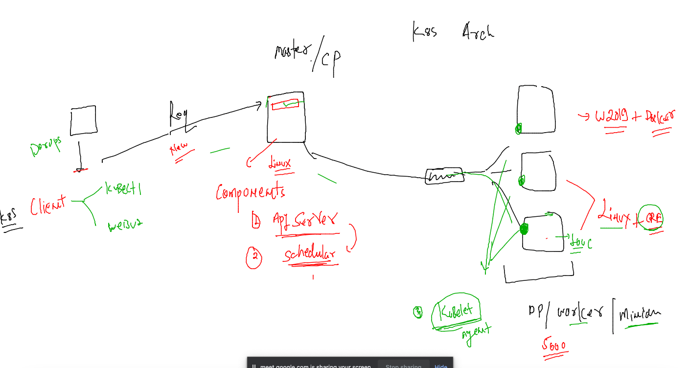
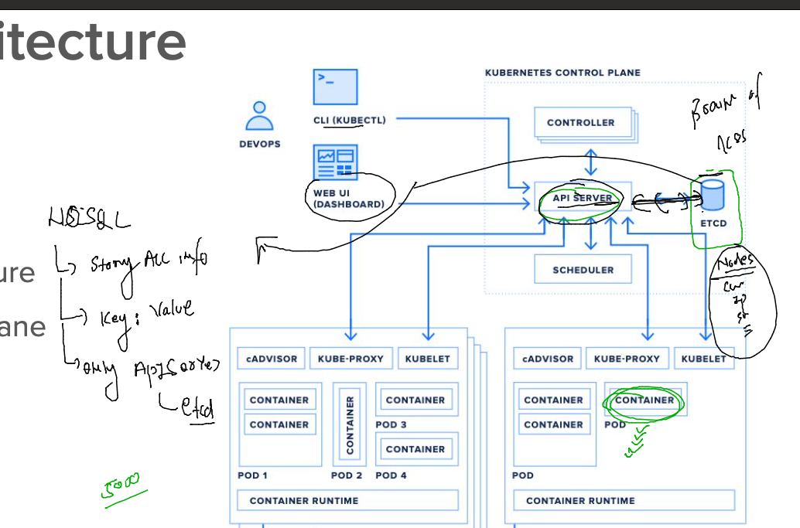

# devops-25ujne2022

### Linux target 


### aws cloud target 


## components of Control plan & worker Side 

### architecture 



## ETCD -- brain of k8s 



### Installing k8s client software -- kubectl 

[link](https://kubernetes.io/docs/tasks/tools/)

### Installing on Mac 

```
fire@ashutoshhs-MacBook-Air ~ % curl -LO "https://dl.k8s.io/release/$(curl -L -s https://dl.k8s.io/release/stable.txt)/bin/darwin/amd64/kubectl"
  % Total    % Received % Xferd  Average Speed   Time    Time     Time  Current
                                 Dload  Upload   Total   Spent    Left  Speed
100   138  100   138    0     0    368      0 --:--:-- --:--:-- --:--:--   367
100 47.8M  100 47.8M    0     0  6178k      0  0:00:07  0:00:07 --:--:-- 7341k
fire@ashutoshhs-MacBook-Air ~ % ls
Applications		Library			Public			kubectl
Desktop			Movies			certs			sa.kubeconfig
Documents		Music			config_file_create.sh	svc.yml
Downloads		Pictures		go
fire@ashutoshhs-MacBook-Air ~ % 
fire@ashutoshhs-MacBook-Air ~ % sudo cp -v kubectl /usr/bin 
Password:
cp: /usr/bin/kubectl: Operation not permitted
fire@ashutoshhs-MacBook-Air ~ % sudo cp -v kubectl /usr/local/bin 
kubectl -> /usr/local/bin/kubectl
fire@ashutoshhs-MacBook-Air ~ % 
fire@ashutoshhs-MacBook-Air ~ % chmod +x /usr/local/bin/kubectl
fire@ashutoshhs-MacBook-Air ~ % 
fire@ashutoshhs-MacBook-Air ~ % kubectl version --client 
WARNING: This version information is deprecated and will be replaced with the output from kubectl version --short.  Use --output=yaml|json to get the full version.
Client Version: version.Info{Major:"1", Minor:"25", GitVersion:"v1.25.3", GitCommit:"434bfd82814af038ad94d62ebe59b133fcb50506", GitTreeState:"clean", BuildDate:"2022-10-12T10:57:26Z", GoVersion:"go1.19.2", Compiler:"gc", Platform:"darwin/amd64"}
Kustomize Version: v4.5.7

```

### Installin on Ubuntu 

```
baby@babykool:~$ curl -LO "https://dl.k8s.io/release/$(curl -L -s https://dl.k8s.io/release/stable.txt)/bin/linux/amd64/kubectl"
  % Total    % Received % Xferd  Average Speed   Time    Time     Time  Current
                                 Dload  Upload   Total   Spent    Left  Speed
100   138  100   138    0     0    404      0 --:--:-- --:--:-- --:--:--   403
100 42.9M  100 42.9M    0     0  9678k      0  0:00:04  0:00:04 --:--:-- 12.2M
baby@babykool:~$ ls
 Desktop     Music      Templates             'a b c.txt'   get-docker.sh   ok.txt    this.txt
 Documents   Pictures  'Untitled Document 1'   a.txt        images          snap
 Downloads   Public     Videos                 ashu.pub     kubectl         test111
baby@babykool:~$ sudo cp -v kubectl  /usr/bin/
[sudo] password for baby: 
'kubectl' -> '/usr/bin/kubectl'
baby@babykool:~$ sudo chmod +x  /usr/bin/kubectl 
baby@babykool:~$ 
baby@babykool:~$ kubectl  version --client 
WARNING: This version information is deprecated and will be replaced with the output from kubectl version --short.  Use --output=yaml|json to get the full version.
Client Version: version.Info{Major:"1", Minor:"25", GitVersion:"v1.25.3", GitCommit:"434bfd82814af038ad94d62ebe59b133fcb50506", GitTreeState:"clean", BuildDate:"2022-10-12T10:57:26Z", GoVersion:"go1.19.2", Compiler:"gc", Platform:"linux/amd64"}
Kustomize Version: v4.5.7
```


