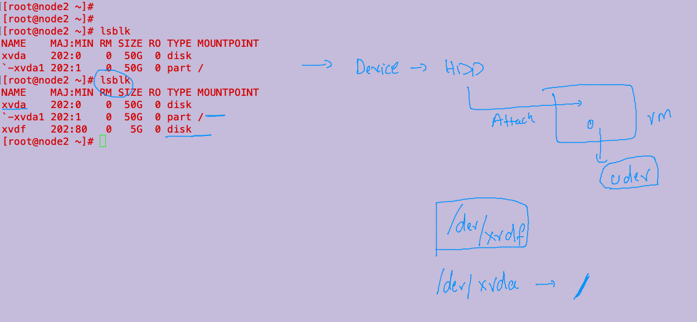
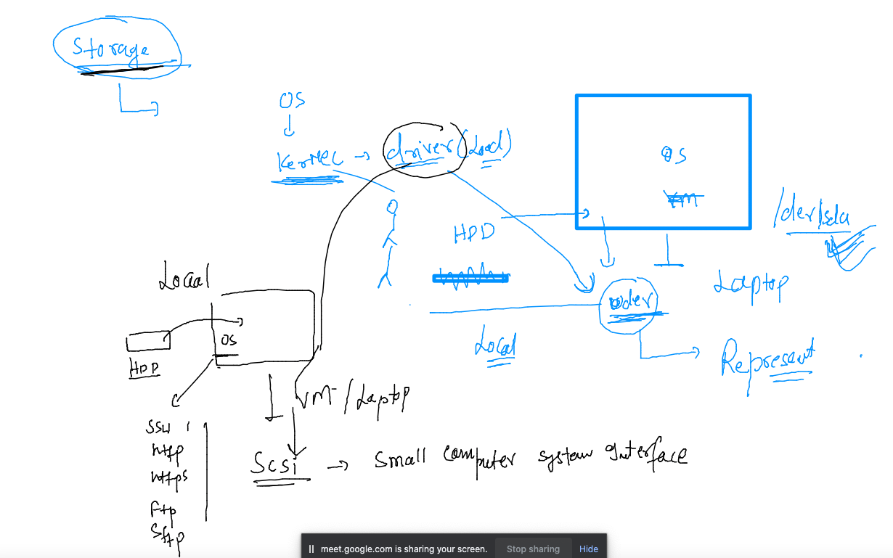

# devops-25ujne2022

### Linux target 


### aws cloud target 


### checking list of hdd in linux 

```
[root@node2 ~]# lsblk 
NAME    MAJ:MIN RM SIZE RO TYPE MOUNTPOINT
xvda    202:0    0  50G  0 disk 
`-xvda1 202:1    0  50G  0 part /
[root@node2 ~]# lsblk 
NAME    MAJ:MIN RM SIZE RO TYPE MOUNTPOINT
xvda    202:0    0  50G  0 disk 
`-xvda1 202:1    0  50G  0 part /
xvdf    202:80   0   5G  0 disk 
[root@node2 ~]# 


```

### understanding Udev again 



### Understanding SCSI for local system 



### making partition and formating it 

```
[root@node2 ~]# lsblk 
NAME    MAJ:MIN RM SIZE RO TYPE MOUNTPOINT
xvda    202:0    0  50G  0 disk 
`-xvda1 202:1    0  50G  0 part /
[root@node2 ~]# lsblk 
NAME    MAJ:MIN RM SIZE RO TYPE MOUNTPOINT
xvda    202:0    0  50G  0 disk 
`-xvda1 202:1    0  50G  0 part /
xvdf    202:80   0   5G  0 disk 
[root@node2 ~]# gdisk  /dev/xvdf 
GPT fdisk (gdisk) version 0.8.10

Partition table scan:
  MBR: not present
  BSD: not present
  APM: not present
  GPT: not present

Creating new GPT entries.

Command (? for help): p
Disk /dev/xvdf: 10485760 sectors, 5.0 GiB
Logical sector size: 512 bytes
Disk identifier (GUID): C64DB353-A683-4F9C-9AA2-86C8F4450E2E
Partition table holds up to 128 entries
First usable sector is 34, last usable sector is 10485726
Partitions will be aligned on 2048-sector boundaries
Total free space is 10485693 sectors (5.0 GiB)

Number  Start (sector)    End (sector)  Size       Code  Name

Command (? for help): n
Partition number (1-128, default 1): 
First sector (34-10485726, default = 2048) or {+-}size{KMGTP}: 
Last sector (2048-10485726, default = 10485726) or {+-}size{KMGTP}: +2G 
Current type is 'Linux filesystem'
Hex code or GUID (L to show codes, Enter = 8300): 
Changed type of partition to 'Linux filesystem'

Command (? for help): p
Disk /dev/xvdf: 10485760 sectors, 5.0 GiB
Logical sector size: 512 bytes
Disk identifier (GUID): C64DB353-A683-4F9C-9AA2-86C8F4450E2E
Partition table holds up to 128 entries
First usable sector is 34, last usable sector is 10485726
Partitions will be aligned on 2048-sector boundaries
Total free space is 6291389 sectors (3.0 GiB)

Number  Start (sector)    End (sector)  Size       Code  Name
   1            2048         4196351   2.0 GiB     8300  Linux filesystem

Command (? for help): w

Final checks complete. About to write GPT data. THIS WILL OVERWRITE EXISTING
PARTITIONS!!

Do you want to proceed? (Y/N): y
OK; writing new GUID partition table (GPT) to /dev/xvdf.
The operation has completed successfully.
[root@node2 ~]# lsblk 
NAME    MAJ:MIN RM SIZE RO TYPE MOUNTPOINT
xvda    202:0    0  50G  0 disk 
`-xvda1 202:1    0  50G  0 part /
xvdf    202:80   0   5G  0 disk 
`-xvdf1 202:81   0   2G  0 part 
[root@node2 ~]# mkfs.xfs  /dev/xvdf1 
meta-data=/dev/xvdf1             isize=512    agcount=4, agsize=131072 blks
         =                       sectsz=512   attr=2, projid32bit=1
         =                       crc=1        finobt=1, sparse=0
data     =                       bsize=4096   blocks=524288, imaxpct=25
         =                       sunit=0      swidth=0 blks
naming   =version 2              bsize=4096   ascii-ci=0 ftype=1
log      =internal log           bsize=4096   blocks=2560, version=2
         =                       sectsz=512   sunit=0 blks, lazy-count=1
realtime =none                   extsz=4096   blocks=0, rtextents=0
[root@node2 ~]# mkdir /mnt/ok
[root@node2 ~]# mount  /dev/xvdf1  /mnt/ok
[root@node2 ~]# vim /etc/fstab 
[root@node2 ~]# mount -a 
[root@node2 ~]# cat /etc/fstab 
#
UUID=111667cd-96f8-41ba-bb2d-7c558ae6ad71     /           xfs    defaults,noatime  1   1
 /dev/xvdf1  /mnt/ok  xfs  defaults 0 0 
[root@node2 ~]# 

```


