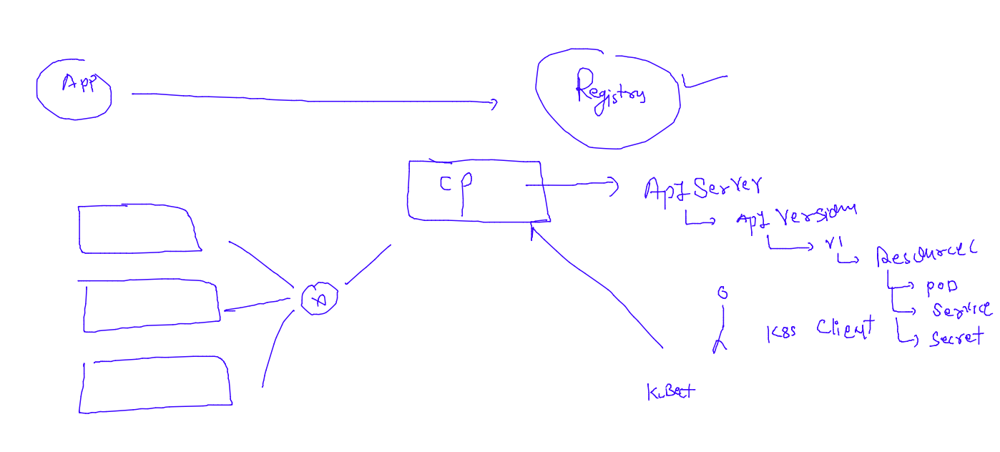
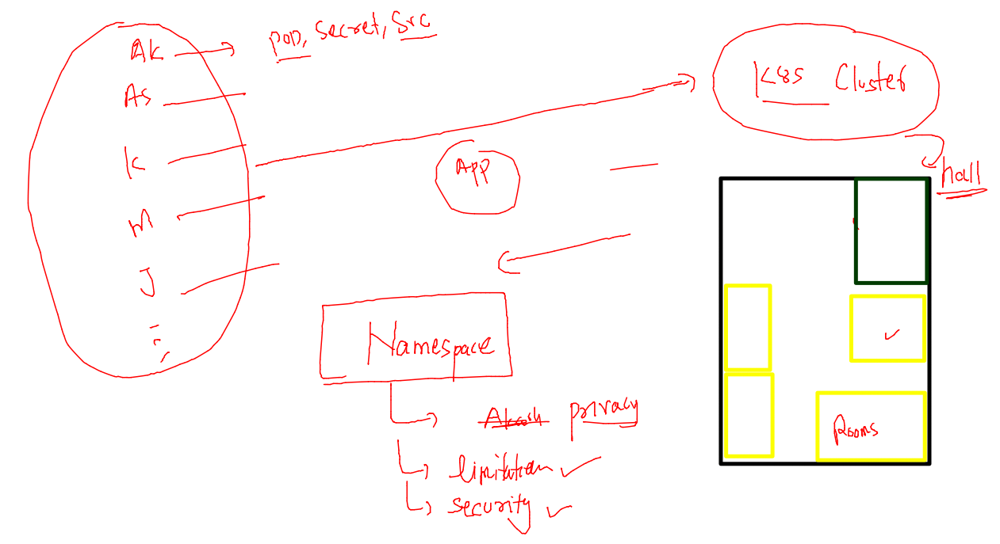
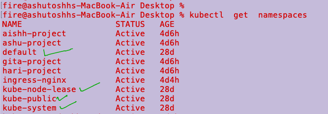
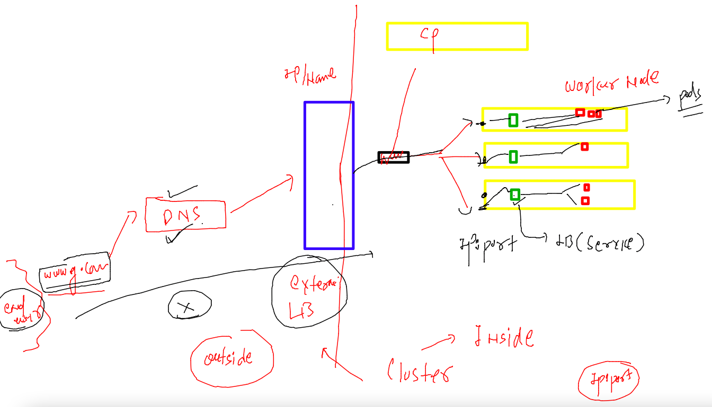
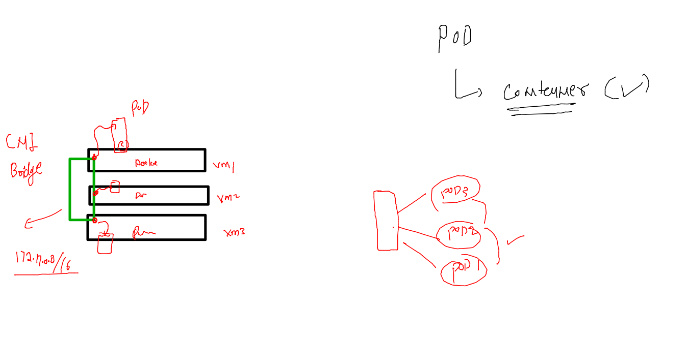
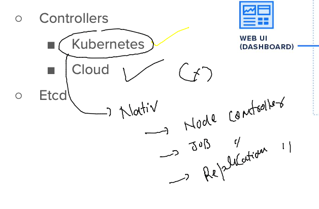
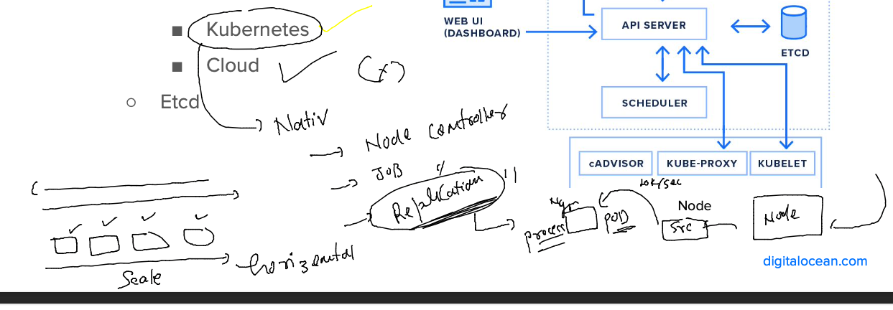

# devops-25ujne2022

### Linux target 


### aws cloud target 


### K8s Revision 



### Namespaces Understanding 



### Default namespaces in k8s 



### importance of kube-system namespace 

```
fire@ashutoshhs-MacBook-Air Desktop % kubectl   get  pod  -n kube-system 
NAME                                       READY   STATUS    RESTARTS      AGE
calico-kube-controllers-58dbc876ff-vjrt8   1/1     Running   7 (14m ago)   28d
calico-node-8sdk7                          1/1     Running   7 (14m ago)   28d
calico-node-d4zcc                          1/1     Running   7 (14m ago)   28d
calico-node-qzvk8                          1/1     Running   7 (13m ago)   28d
coredns-565d847f94-fh6bd                   1/1     Running   7 (14m ago)   28d
coredns-565d847f94-k6dzc                   1/1     Running   7 (14m ago)   28d
etcd-control-plane                         1/1     Running   7 (14m ago)   28d
kube-apiserver-control-plane               1/1     Running   7 (14m ago)   28d
kube-controller-manager-control-plane      1/1     Running   7 (14m ago)   28d
kube-proxy-4kqth                           1/1     Running   7 (14m ago)   28d
kube-proxy-9xrbh                           1/1     Running   7 (13m ago)   28d
kube-proxy-bkldn                           1/1     Running   7 (14m ago)   28d
kube-scheduler-control-plane               1/1     Running   7 (14m ago)   28d
metrics-server-767967fcd-r4ssv             1/1     Running   1 (13m ago)   4d
fire@ashutoshhs-MacBook-Air Desktop % 

```

### creating and set-default to a namespace 

```
fire@ashutoshhs-MacBook-Air Desktop % kubectl  create  namespace  ashu-space --dry-run=client -o yaml 
apiVersion: v1
kind: Namespace
metadata:
  creationTimestamp: null
  name: ashu-space
spec: {}
status: {}
fire@ashutoshhs-MacBook-Air Desktop % kubectl  create  namespace  ashu-space                          
namespace/ashu-space created
fire@ashutoshhs-MacBook-Air Desktop % kubectl  get  ns |   grep ashu
ashu-project           Active   4d7h
ashu-space             Active   6s
fire@ashutoshhs-MacBook-Air Desktop % kubectl  config set-context --current --namespace=ashu-space 
Context "kubernetes-admin@kubernetes" modified.
fire@ashutoshhs-MacBook-Air Desktop % 
fire@ashutoshhs-MacBook-Air Desktop % kubectl  get  pods
No resources found in ashu-space namespace.
fire@ashutoshhs-MacBook-Air Desktop % kubectl  get  svc 
No resources found in ashu-space namespace.
fire@ashutoshhs-MacBook-Air Desktop % kubectl  get  secret
No resources found in ashu-space namespace.
fire@ashutoshhs-MacBook-Air Desktop % 

```

### mention namespace entry in YAML 

```
apiVersion: v1
kind: Pod
metadata:
  creationTimestamp: null
  labels:
    run: ashupodx3
  name: ashupodx3
  namespace: kube-public # namespace field 
spec:
  containers:
  - image: nginx
    name: ashupodx3
    ports:
    - containerPort: 80
    resources: {}
  dnsPolicy: ClusterFirst
  restartPolicy: Always
status: {}

```

### apply if 

```
fire@ashutoshhs-MacBook-Air kubernetes % kubectl  get po,svc -n kube-public
No resources found in kube-public namespace.
fire@ashutoshhs-MacBook-Air kubernetes % kubectl apply -f auto.yaml -f np11.yaml 
pod/ashupodx3 created
service/ashulb1 created
fire@ashutoshhs-MacBook-Air kubernetes % 
fire@ashutoshhs-MacBook-Air kubernetes % 
fire@ashutoshhs-MacBook-Air kubernetes % kubectl  get po,svc -n kube-public     
NAME            READY   STATUS              RESTARTS   AGE
pod/ashupodx3   0/1     ContainerCreating   0          2s

NAME              TYPE       CLUSTER-IP      EXTERNAL-IP   PORT(S)          AGE
service/ashulb1   NodePort   10.108.67.129   <none>        1234:30332/TCP   2s
fire@ashutoshhs-MacBook-Air kubernetes % 

```

## Networking in k8s 



### choosing CNI over CNM by k8s 


### pods by default can communicate to each other even they are in different systems 



### lets verify that project calico is OUR CNI 

```
fire@ashutoshhs-MacBook-Air Desktop % kubectl  get po 
No resources found in ashu-space namespace.
fire@ashutoshhs-MacBook-Air Desktop % kubectl  run ashupod1 --image=alpine --command sleep 10000 
pod/ashupod1 created
fire@ashutoshhs-MacBook-Air Desktop % kubectl  get  po 
NAME       READY   STATUS              RESTARTS   AGE
ashupod1   0/1     ContainerCreating   0          3s
fire@ashutoshhs-MacBook-Air Desktop % kubectl  get  po 
NAME       READY   STATUS    RESTARTS   AGE
ashupod1   1/1     Running   0          6s
fire@ashutoshhs-MacBook-Air Desktop % kubectl  get  po -o wide
NAME       READY   STATUS    RESTARTS   AGE   IP                NODE      NOMINATED NODE   READINESS GATES
ashupod1   1/1     Running   0          10s   192.168.235.148   worker1   <none>           <none>
fire@ashutoshhs-MacBook-Air Desktop % kubectl  describe pod ashupod1 
Name:             ashupod1
Namespace:        ashu-space
Priority:         0
Service Account:  default
Node:             worker1/172.31.32.194
Start Time:       Wed, 16 Nov 2022 17:32:41 +0530
Labels:           run=ashupod1
Annotations:      cni.projectcalico.org/containerID: 6a1bb5970fb6751744c6c1e7e4113ba400ca975130bb1a4113dc4f7d090e98f2
                  cni.projectcalico.org/podIP: 192.168.235.148/32
                  cni.projectcalico.org/podIPs: 192.168.235.148/32
Status:           Running
IP:               192.168.235.148
IPs:
  IP:  192.168.235.148
Containers:

```

## OR 

```

fire@ashutoshhs-MacBook-Air Desktop % kubectl  get po -n kube-system                             
NAME                                       READY   STATUS    RESTARTS      AGE
calico-kube-controllers-58dbc876ff-vjrt8   1/1     Running   8 (32m ago)   29d
calico-node-8sdk7                          1/1     Running   8 (32m ago)   29d
calico-node-d4zcc                          1/1     Running   8 (32m ago)   29d
calico-node-qzvk8                          1/1     Running   8 (33m ago)   29d
```

# COntroller in k8s 

### k8s Nativ controllers 



### REplication controllers to scale pods  (horizentally)



### YAML of RC 

```
apiVersion: v1
kind: ReplicationController
metadata:
  name: ashu-rc-1 # name of rc 
spec: 
  replicas: 1 # number of pods we want 
  template:
    metadata:
      labels: # lable of pods 
        x: helloashu
    spec:
      containers:
      - name: ashuc1 
        image: nginx 
        ports:
        - containerPort: 80 
```

### lets do it 

```
fire@ashutoshhs-MacBook-Air kubernetes % kubectl apply -f rc1.yaml
replicationcontroller/ashu-rc-1 created
fire@ashutoshhs-MacBook-Air kubernetes % 
fire@ashutoshhs-MacBook-Air kubernetes % kubectl  get  rc 
NAME        DESIRED   CURRENT   READY   AGE
ashu-rc-1   1         1         1       6s
fire@ashutoshhs-MacBook-Air kubernetes % kubectl  get po 
NAME              READY   STATUS    RESTARTS   AGE
ashu-rc-1-5gm4z   1/1     Running   0          13s
fire@ashutoshhs-MacBook-Air kubernetes % kubectl delete pod ashu-rc-1-5gm4z
pod "ashu-rc-1-5gm4z" deleted
fire@ashutoshhs-MacBook-Air kubernetes % kubectl  get po                   
NAME              READY   STATUS    RESTARTS   AGE
ashu-rc-1-rkcst   1/1     Running   0          4s
fire@ashutoshhs-MacBook-Air kubernetes % 
```

### scaling pod without yaml change 

```
fire@ashutoshhs-MacBook-Air kubernetes % kubectl  get  rc             
NAME        DESIRED   CURRENT   READY   AGE
ashu-rc-1   1         1         1       2m30s
fire@ashutoshhs-MacBook-Air kubernetes % kubectl  scale rc  ashu-rc-1 --replicas=5
replicationcontroller/ashu-rc-1 scaled
fire@ashutoshhs-MacBook-Air kubernetes % kubectl  get  rc                         
NAME        DESIRED   CURRENT   READY   AGE
ashu-rc-1   5         5         5       2m46s
fire@ashutoshhs-MacBook-Air kubernetes % kubectl  get po                          
NAME              READY   STATUS    RESTARTS   AGE
ashu-rc-1-6jp6v   1/1     Running   0          9s
ashu-rc-1-d49hj   1/1     Running   0          9s
ashu-rc-1-rkcst   1/1     Running   0          2m26s
ashu-rc-1-rvb9z   1/1     Running   0          9s
```


