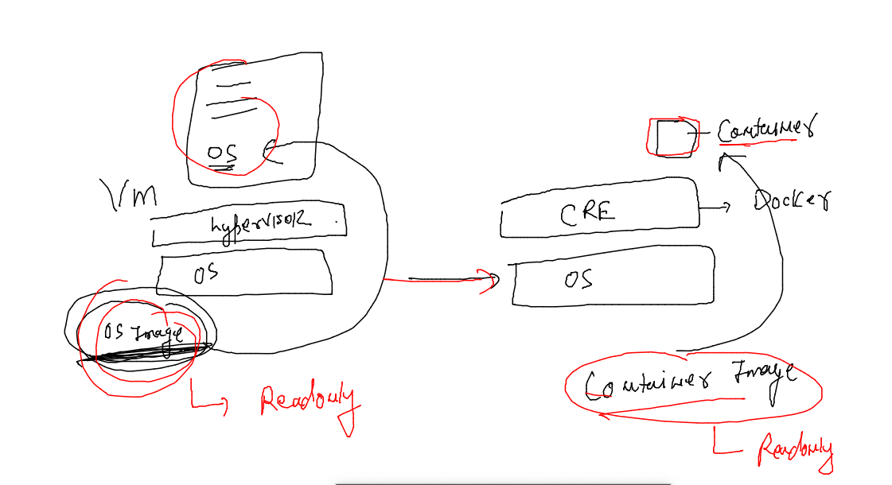
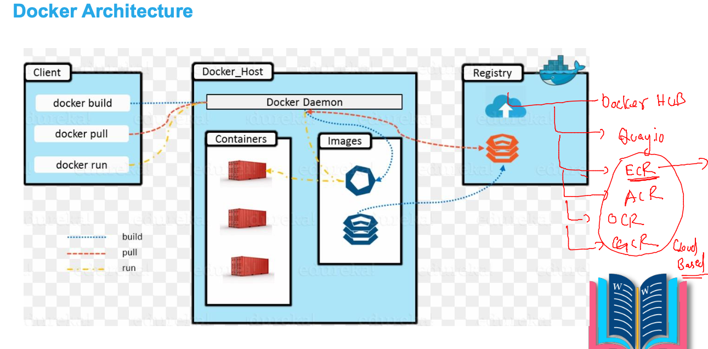
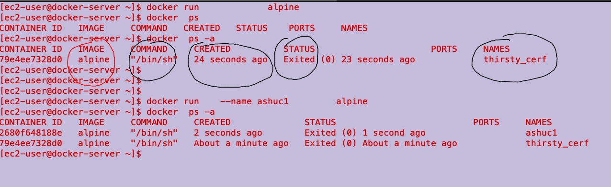

# devops-25ujne2022

### Linux target 


### aws cloud target 


## Docker CE version 


### we are gonna use 20.x version 

### installation docs 
[link](https://docs.docker.com/engine/install/)

### Install docker server 

```
[root@docker-server ~]# yum  install docker  -y
Failed to set locale, defaulting to C
Loaded plugins: extras_suggestions, langpacks, priorities, update-motd
amzn2-core                                                                                              | 3.7 kB  00:00:00     
Resolving Dependencies
--> Running transaction check
---> Package docker.x86_64 0:20.10.17-1.amzn2 will be installed
--> Processing Dependency: runc >= 1.0.0 for package: docker-20.10.17-1.amzn2.x86_64
--> Processing Dependency: libcgroup >= 0.40.rc1-5.15 for package: docker-20.10.17-1.amzn2.x86_64
--> Processing Dependency: containerd >= 1.3.2 for package: docker-20.10.17-1.amzn2.x86_64
--> Processing Dependency: pigz for package: docker-20.10.17-1.amzn2.x86_64
--> Running transaction check
---> Package containerd.x86_64 0:1.6.6-1.amzn2 will be installed
---> Package libcgroup.x86_64 0:0.41-21.amzn2 will be installed
---> Package pigz.x86_64 0:2.3.4-1.amzn2.0.1 will be installed
---> Package runc.x86_64 0:1.1.3-1.amzn2 will be installed
--> Finished Dependency Resolution
```

### start docker service 

```
[root@docker-server ~]# systemctl start  docker 
[root@docker-server ~]# systemctl status  docker 
● docker.service - Docker Application Container Engine
   Loaded: loaded (/usr/lib/systemd/system/docker.service; disabled; vendor preset: disabled)
   Active: active (running) since Sun 2022-09-11 05:32:58 UTC; 4s ago
     Docs: https://docs.docker.com
  Process: 3510 ExecStartPre=/usr/libexec/docker/docker-setup-runtimes.sh (code=exited, status=0/SUCCESS)
  Process: 3509 ExecStartPre=/bin/mkdir -p /run/docker (code=exited, status=0/SUCCESS)
 Main PID: 3513 (dockerd)
    Tasks: 7

```

## Docker instruction 

### version 

```
[root@docker-server ~]# docker  version 
Client:
 Version:           20.10.17
 API version:       1.41
 Go version:        go1.18.3
 Git commit:        100c701
 Built:             Thu Jun 16 20:08:47 2022
 OS/Arch:           linux/amd64
 Context:           default
 Experimental:      true

Server:
 Engine:
  Version:          20.10.17
  API version:      1.41 (minimum version 1.12)
  Go version:       go1.18.3
  Git commit:       a89b842
  Built:            Thu Jun 16 20:09:24 2022
  OS/Arch:          linux/amd64
  Experimental:     false
 containerd:
  Version:          1.6.6
```

### Note: never use docker as root user 


### adding non root user to docker gorup 

```
[ec2-user@ip-172-31-92-193 ~]$ grep docker  /etc/group
docker:x:992:
[ec2-user@ip-172-31-92-193 ~]$ sudo usermod -a -G docker  ec2-user
[ec2-user@ip-172-31-92-193 ~]$ grep docker  /etc/group
docker:x:992:ec2-user
[ec2-user@ip-172-31-92-193 ~]$ 
```

### Note : close terminal in case of local system or logout via ssh in case of remote vm 

###

```
[ec2-user@docker-server ~]$ docker version 
Client:
 Version:           20.10.17
 API version:       1.41
 Go version:        go1.18.3
 Git commit:        100c701
 Built:             Thu Jun 16 20:08:47 2022
 OS/Arch:           linux/amd64
 Context:           default
 Experimental:      true

Server:
 Engine:
  Version:          20.10.17
  API version:      1.41 (minimum version 1.12)
  Go version:       go1.18.3
  Git commit:       a89b842
  Built:            Thu Jun 16 20:09:24 2022
```

### check again 

```
  12  useradd u1
   13  su - u1
   14  grep docker  /etc/group 
   15  usermod -aG docker  u1 
   16  su - u1
   17  history 
[root@docker-server ~]# useradd -G docker u2
[root@docker-server ~]# 
[root@docker-server ~]# 
[root@docker-server ~]# grep docker  /etc/group 
docker:x:992:ec2-user,u1,u2

```

## creating containers



### image storage -- registry 



### checking docker images 

```
[ec2-user@docker-server ~]$ docker  images
REPOSITORY   TAG       IMAGE ID   CREATED   SIZE
[ec2-user@docker-server ~]$ 

```

### searching images 

```
[ec2-user@docker-server ~]$ docker  search  httpd
NAME                                    DESCRIPTION                                     STARS     OFFICIAL   AUTOMATED
httpd                                   The Apache HTTP Server Project                  4154      [OK]       
centos/httpd-24-centos7                 Platform for running Apache httpd 2.4 or bui…   44                   
centos/httpd                                                                            35                   [OK]
clearlinux/httpd                        httpd HyperText Transfer Protocol (HTTP) ser…   2                    
hypoport/httpd-cgi                      httpd-cgi                                       2                    [OK]
solsson/httpd-openidc                   mod_auth_openidc on official httpd image, ve…   2                    [OK]
dockerpinata/ht
```

### image pull 

```
   20  docker  pull httpd
   21  docker  pull bash
   22  docker  pull ubuntu 
   23  history 
[ec2-user@docker-server ~]$ docker  images
REPOSITORY   TAG       IMAGE ID       CREATED       SIZE
ubuntu       latest    2dc39ba059dc   9 days ago    77.8MB
httpd        latest    a981c8992512   2 weeks ago   145MB
bash         latest    58c36729bafd   4 weeks ago   13MB
```

### pulling multiple image s

```
[ec2-user@docker-server ~]$ for  i in  alpine nginx mysql 
> do
> docker pull $i
> sleep 1
> done
Using default tag: latest
latest: Pulling from library/alpine
213ec9aee27d: Pull complete 
Digest: sha256:bc41182d7ef5ffc53a40b044e725193bc10142a1243f395ee852a8d9730fc2ad
Status: Downloaded newer image for alpine:latest
docker.io/library/alpine:latest
Using default tag: latest
latest: Pulling from library/nginx
7a6db449b51b: Already exists 
ca1981974b58: Pull complete 
d4019c921e20: Pull complete 
7cb804d746d4: Pull complete 
e7a561826262: Pull complete 
7247f6e5c182: Pull complete 
Digest: sha256:b95a99feebf7797479e0c5eb5ec0bdfa5d9f504bc94da550c2f58e839ea6914f
Status: Downloaded newer image for nginx:latest
docker.io/library/nginx:latest
Using default tag: latest
latest: Pulling from library/mysql
492d84e496ea: Pull complete 
bbe20050901c: Pull complete 
e3a5e171c2f8: Pull complete 
c2cedd8aa061: Pull complete 
d6a485af4cc9: Pull complete 
ee16a57baf60: Pull complete 
64bab9180d2a: Pull complete 
c3aceb7e4f48: Pull complete 
269002e5cf58: Pull complete 
d5abeb1bd18e: Pull complete 
cbd79da5fab6: Pull complete 
Digest: sha256:cdf3b62d78d1bbb1d2bd6716895a84014e00716177cbb7e90f6c6a37a21dc796
Status: Downloaded newer image for mysql:latest
docker.io/library/mysql:latest

```

### creating container 



### creating container 

```
   46  docker run    --name ashuc3  -d  alpine ping google.com 
   47  docker  ps
   48  docker  ps -a
   49  history 
[ec2-user@docker-server ~]$ docker  ps -a
CONTAINER ID   IMAGE     COMMAND             CREATED              STATUS                          PORTS     NAMES
5424a23be72b   alpine    "ping google.com"   About a minute ago   Up About a minute                         ashuc3
33fdcec08767   alpine    "ping google.com"   About a minute ago   Exited (0) About a minute ago             ashuc2
2680f648188e   alpine    "/bin/sh"           4 minutes ago        Exited (0) 4 minutes ago                  ashuc1
79e4ee7328d0   alpine    "/bin/sh"           5 minutes ago        Exited (0) 5 minutes ago                  thirsty_cerf
```

### output check 

```
[ec2-user@docker-server ~]$ docker  ps
CONTAINER ID   IMAGE     COMMAND             CREATED         STATUS         PORTS     NAMES
5424a23be72b   alpine    "ping google.com"   2 minutes ago   Up 2 minutes             ashuc3
[ec2-user@docker-server ~]$ docker logs  ashuc3
PING google.com (172.253.115.102): 56 data bytes
64 bytes from 172.253.115.102: seq=0 ttl=48 time=1.396 ms
64 bytes from 172.253.115.102: seq=1 ttl=48 time=1.502 ms
64 bytes from 172.253.115.102: seq=2 ttl=48 time=1.501 ms
64 bytes from 172.253.115.102: seq=3 ttl=48 time=1.515 ms
64 bytes from 172.253.115.102: seq=4 ttl=48 time=1.491 ms
64 bytes from 172.253.
```


