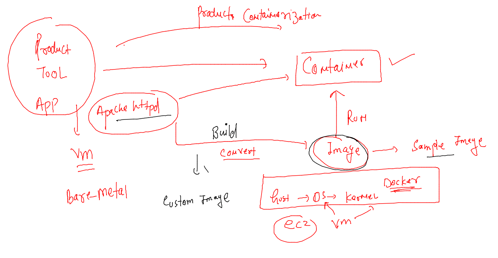
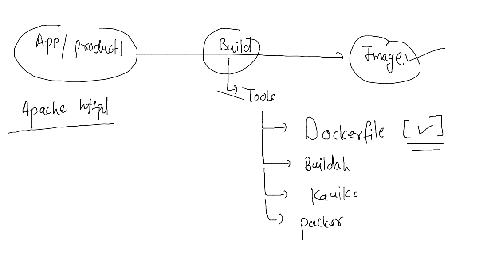

# devops-25ujne2022

### Linux target 


### aws cloud target 


## application containerization 



### to build images we can use some image build tool 



## apache httpd containerization 

### Dockerfile 

```
FROM oraclelinux:8.4 
# we are taking on base image from docker hub 
LABEL name=ashutoshh
LABEL email=ashutoshh@linux.com
# label optional field but you can share your info 
RUN yum install httpd -y 
COPY hello.html  /var/www/html/index.html 
CMD ["/usr/sbin/httpd","-DFOREGROUND"]
# is used to set default process of image
```

### hello.html

```
<h1>  Hello i am httpd  </h1>
```

### build image 

```
[root@mobi-dockerserver myimages]# docker build  -t  ashuhttpd:v1  . 
Sending build context to Docker daemon  3.072kB
Step 1/6 : FROM oraclelinux:8.4
 ---> 97e22ab49eea
Step 2/6 : LABEL name=ashutoshh
 ---> Using cache
 ---> cb1dd5361abb
Step 3/6 : LABEL email=ashutoshh@linux.com
 ---> Using cache
 ---> 21f5ace4f4af
Step 4/6 : RUN yum install httpd -y
 ---> Using cache
 ---> 9b1f813bd757
Step 5/6 : COPY hello.html  /var/www/html/index.html
 ---> Using cache
 ---> b911db50bf6d
Step 6/6 : CMD ["/usr/sbin/httpd","-DFOREGROUND"]
 ---> Using cache
 ---> 3d78a3a3ad55
Successfully built 3d78a3a3ad55
Successfully tagged ashuhttpd:v1
```

### checking image 

```
[root@mobi-dockerserver myimages]# docker images 
REPOSITORY                    TAG       IMAGE ID       CREATED              SIZE
ashuhttpd                     v1        3d78a3a3ad55   About a minute ago   442MB
nunoinx                       appv1     1c2f3f4a4b78   2 days ago           144MB
```

### lets create container 

```
[root@mobi-dockerserver myimages]# docker run -itd --name c3 ashuhttpd:v1  
82754f28b8cb8d4c0a8d8a1681fc99b428a558eb20357aedd85da28dd1481f7b
[root@mobi-dockerserver myimages]# docker  ps
CONTAINER ID   IMAGE             COMMAND                  CREATED          STATUS          PORTS     NAMES
82754f28b8cb   ashuhttpd:v1      "/usr/sbin/httpd -DF…"   3 seconds ago    Up 2 seconds              c3
```

