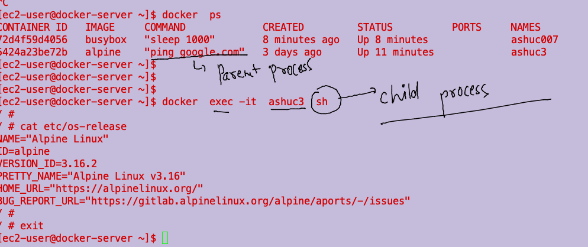

# devops-25ujne2022

### Linux target 


### aws cloud target 


### starting a  container

```
[ec2-user@docker-server ~]$ docker  ps -a
CONTAINER ID   IMAGE     COMMAND             CREATED      STATUS                    PORTS     NAMES
5424a23be72b   alpine    "ping google.com"   3 days ago   Exited (137) 3 days ago             ashuc3
33fdcec08767   alpine    "ping google.com"   3 days ago   Exited (0) 3 days ago               ashuc2
2680f648188e   alpine    "/bin/sh"           3 days ago   Exited (0) 3 days ago               ashuc1
79e4ee7328d0   alpine    "/bin/sh"           3 days ago   Exited (0) 3 days ago               thirsty_cerf
[ec2-user@docker-server ~]$ docker  start  ashuc3
ashuc3
[ec2-user@docker-server ~]$ docker  ps
CONTAINER ID   IMAGE     COMMAND             CREATED      STATUS         PORTS     NAMES
5424a23be72b   alpine    "ping google.com"   3 days ago   Up 4 seconds             ashuc3
[ec2-user@docker-server ~]$ 

```

### creating a contaienr with Interactive terminal mode 

```
[ec2-user@docker-server ~]$ docker run  -it --name ashu0999  ubuntu  bash 
root@13da6121d433:/# cat  /etc/os-release 
PRETTY_NAME="Ubuntu 22.04.1 LTS"
NAME="Ubuntu"
VERSION_ID="22.04"
VERSION="22.04.1 LTS (Jammy Jellyfish)"
VERSION_CODENAME=jammy
ID=ubuntu
ID_LIKE=debian
HOME_URL="https://www.ubuntu.com/"
SUPPORT_URL="https://help.ubuntu.com/"
BUG_REPORT_URL="https://bugs.launchpad.net/ubuntu/"
PRIVACY_POLICY_URL="https://www.ubuntu.com/legal/terms-and-policies/privacy-policy"
UBUNTU_CODENAME=jammy
root@13da6121d433:/# whoami
root
root@13da6121d433:/# exit
exit
[ec2-user@docker-server ~]$ docker  ps 
CONTAINER ID   IMAGE     COMMAND             CREATED         STATUS         PORTS     NAMES
72d4f59d4056   busybox   "sleep 1000"        2 minutes ago   Up 2 minutes             ashuc007
5424a23be72b   alpine    "ping google.com"   3 days ago      Up 5 minutes             ashuc3
[ec2-user@docker-server ~]$ docker  ps  -a
CONTAINER ID   IMAGE     COMMAND             CREATED          STATUS                      PORTS     NAMES
13da6121d433   ubuntu    "bash"              34 seconds ago   Exited (0) 11 seconds ago             ashu0999
72d4f59d4056   busybox   "sleep 1000"        2 minutes ago    Up 2 minutes                          ashuc007
5424a23be72b   alpine    "ping google.com"   3 days ago       Up 5 minutes                          ashuc3
33fdcec08767   alpine    "ping google.com"   3 days ago       Exited (0) 3 days ago                 ashuc2
2680f648188e   alpine    "/bin/sh"           3 days ago       Exited (0) 3 days ago                 ashuc1
79e4ee7328d0   alpine    "/bin/sh"           3 days ago       Exited (0) 3 days ago                 thirsty_cerf
[ec2-user@docker-server ~]$ 

```

### checking resources of a running container 

```
[ec2-user@docker-server ~]$ docker  stats
CONTAINER ID   NAME       CPU %     MEM USAGE / LIMIT   MEM %     NET I/O           BLOCK I/O     PIDS
72d4f59d4056   ashuc007   0.00%     360KiB / 965.5MiB   0.04%     850B / 0B         741kB / 0B    1
5424a23be72b   ashuc3     0.02%     520KiB / 965.5MiB   0.05%     67.4kB / 65.8kB   1.35MB / 0B   1

```

### parent process vs child process 



### default process by Developer 

```
[ec2-user@docker-server ~]$ docker run -d -it  --name testc7  busybox 
d79276282a81aed9a648e86366f621ae2dbcab6ad6cc1fb5694e9f4656ec85f8
[ec2-user@docker-server ~]$ 
[ec2-user@docker-server ~]$ 
[ec2-user@docker-server ~]$ docker  ps
CONTAINER ID   IMAGE     COMMAND             CREATED          STATUS          PORTS     NAMES
d79276282a81   busybox   "sh"                15 seconds ago   Up 14 seconds             testc7
72d4f59d4056   busybox   "sleep 1000"        11 minutes ago   Up 11 minutes             ashuc007
5424a23be72b   alpine    "ping google.com"   3 days ago       Up 14 minutes             ashuc3
[ec2-user@docker-server ~]$ 

```


