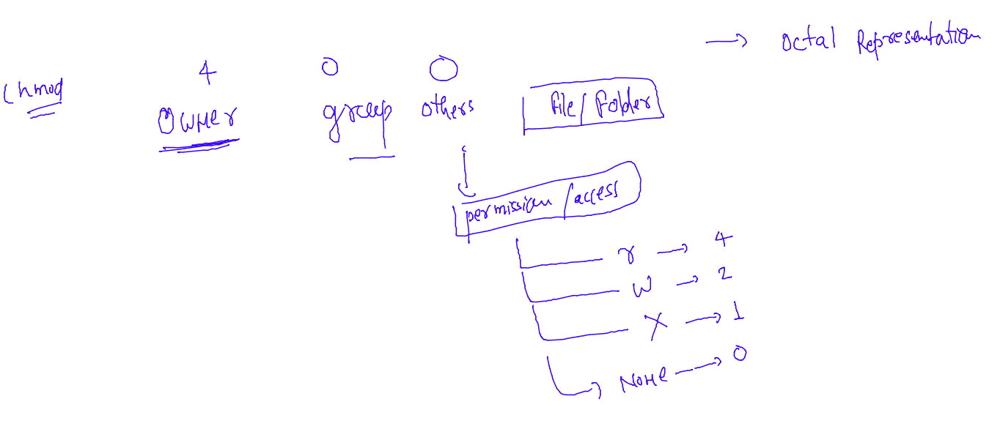

### To test permissions 

### create directory with root user 

```
root@babykool:~# mkdir  /project 
root@babykool:~# 
root@babykool:~# ls  -ld  /project/
drwxr-xr-x 2 root root 4096 Jul 31 12:13 /project/
root@babykool:~# 

```

### for testing -- non root user 

```
baby@babykool:~$ whoami
baby
baby@babykool:~$ cd  /project/
baby@babykool:/project$ ls
baby@babykool:/project$ mkdir bb
mkdir: cannot create directory ‘bb’: Permission denied

```

### removing permissions for others 

```
root@babykool:/project# chmod  o-x   /project/
root@babykool:/project# 
root@babykool:/project# ls -ld  /project/
drwxr-xr-- 5 root root 4096 Jul 31 12:21 /project/
root@babykool:/project# 


```

### testing with others 

```
baby@babykool:~$ cd /project/ 
bash: cd: /project/: Permission denied
baby@babykool:~$ 


```

### Now testing group permission 

```
root@babykool:/project# chmod  g-rx    /project/
root@babykool:/project# 
root@babykool:/project# ls -ld  /project/
drwx---rwx 5 root root 4096 Jul 31 12:28 /project/
root@babykool:/project# 


```

### adding an existing user to some group 

```
root@babykool:/project# groupadd   manager
root@babykool:/project# 
root@babykool:/project# ls -ld /project/
drwx---rwx 5 root root 4096 Jul 31 12:28 /project/
root@babykool:/project# 
root@babykool:/project# chgrp  manager  /project/
root@babykool:/project# 
root@babykool:/project# ls -ld /project/
drwx---rwx 5 root manager 4096 Jul 31 12:28 /project/
root@babykool:/project# 
root@babykool:/project# 
root@babykool:/project# ls /home
baby  bhanu  Jack  jill  mrinal  training
root@babykool:/project# 
root@babykool:/project# 
root@babykool:/project# usermod  -a -G manager  mrinal 
root@babykool:/project# grep -i manager /etc/group 
manager:x:1008:mrinal
root@babykool:/project# 

```

### final command to test 

```
oot@babykool:/project# ls -ld /project/
d--------- 6 root manager 4096 Jul 31 12:32 /project/
root@babykool:/project# chmod  u+rwx,g+rx,o+rx  /project/ 
root@babykool:/project# 
root@babykool:/project# ls -ld /project/
drwxr-xr-x 6 root manager 4096 Jul 31 12:32 /project/
root@babykool:/project# 

```

### --
```
root@babykool:/project# chmod  a-rwx  /project/ 
root@babykool:/project# 
root@babykool:/project# ls -ld /project/
d--------- 6 root manager 4096 Jul 31 12:32 /project/
root@babykool:/project# 
root@babykool:/project# 
root@babykool:/project# chmod  a+rx  /project/ 
root@babykool:/project# 
root@babykool:/project# ls -ld /project/
dr-xr-xr-x 6 root manager 4096 Jul 31 12:32 /project/
root@babykool:/project# 


```

### permission in octal numbers 



### permission demos 

```
[root@docker-server ~]# vim /tmp/hello.txt
[root@docker-server ~]# ls -l /tmp/hello.txt 
-rw-r--r--. 1 root root 16 Aug  2 11:37 /tmp/hello.txt
[root@docker-server ~]# 
[root@docker-server ~]# chmod  400 /tmp/hello.txt 
[root@docker-server ~]# ls -l /tmp/hello.txt 
-r--------. 1 root root 16 Aug  2 11:37 /tmp/hello.txt

====
[root@docker-server ~]# ls -l /tmp/hello.txt 
-r--------. 1 root root 16 Aug  2 11:37 /tmp/hello.txt
[root@docker-server ~]# 
[root@docker-server ~]# 
[root@docker-server ~]# chown 644 /tmp/hello.txt 
[root@docker-server ~]# 
[root@docker-server ~]# ls -l /tmp/hello.txt 
-r--------. 1 644 root 16 Aug  2 11:37 /tmp/hello.txt
[root@docker-server ~]# chmod  644 /tmp/hello.txt 
[root@docker-server ~]# 
[root@docker-server ~]# 
[root@docker-server ~]# ls -l /tmp/hello.txt 
-rw-r--r--. 1 644 root 16 Aug  2 11:37 /tmp/hello.txt
[root@docker-server ~]# 
[root@docker-server ~]# 
[root@docker-server ~]# chown  root  /tmp/hello.txt 
[root@docker-server ~]# 
[root@docker-server ~]# ls -l /tmp/hello.txt 
-rw-r--r--. 1 root root 16 Aug  2 11:37 /tmp/hello.txt
[root@docker-server ~]# 


```

### changing owners and groups 

```
[root@docker-server ~]# ls  -l  /tmp/hello.txt 
-rw-r--r--. 1 root root 16 Aug  2 11:37 /tmp/hello.txt
[root@docker-server ~]# 
[root@docker-server ~]# 
[root@docker-server ~]# useradd jack 
[root@docker-server ~]# 
[root@docker-server ~]# 
[root@docker-server ~]# 
[root@docker-server ~]# ls  -l /tmp/hello.txt 
-rw-r--r--. 1 root root 16 Aug  2 11:37 /tmp/hello.txt
[root@docker-server ~]# 
[root@docker-server ~]# 
[root@docker-server ~]# chown jack  /tmp/hello.txt 
[root@docker-server ~]# 
[root@docker-server ~]# 
[root@docker-server ~]# ls  -l /tmp/hello.txt 
-rw-r--r--. 1 jack root 16 Aug  2 11:37 /tmp/hello.txt
[root@docker-server ~]# 
[root@docker-server ~]# 
[root@docker-server ~]# groupadd  manager
[root@docker-server ~]# 
[root@docker-server ~]# chgrp  manager  /tmp/hello.txt 
[root@docker-server ~]# ls  -l /tmp/hello.txt 
-rw-r--r--. 1 jack manager 16 Aug  2 11:37 /tmp/hello.txt
[root@docker-server ~]# 
[root@docker-server ~]# 
[root@docker-server ~]# chown root:root /tmp/hello.txt 
[root@docker-server ~]# 
[root@docker-server ~]# ls  -l /tmp/hello.txt 
-rw-r--r--. 1 root root 16 Aug  2 11:37 /tmp/hello.txt
[root@docker-server ~]# 
[root@docker-server ~]# 
[root@docker-server ~]# chown jack:manager /tmp/hello.txt 
[root@docker-server ~]# 
[root@docker-server ~]# 
[root@docker-server ~]# ls  -l /tmp/hello.txt 
-rw-r--r--. 1 jack manager 16 Aug  2 11:37 /tmp/hello.txt

```


