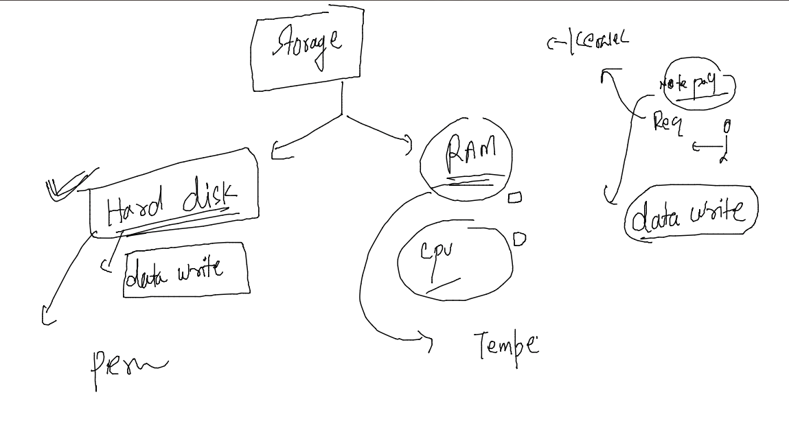
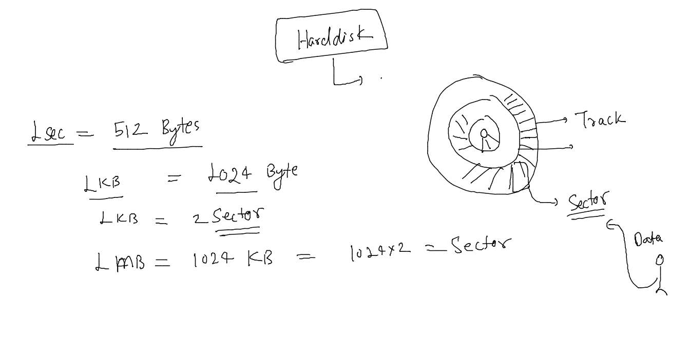
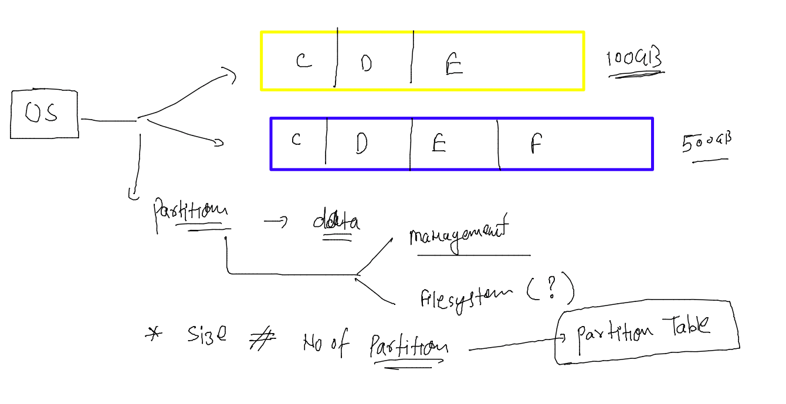
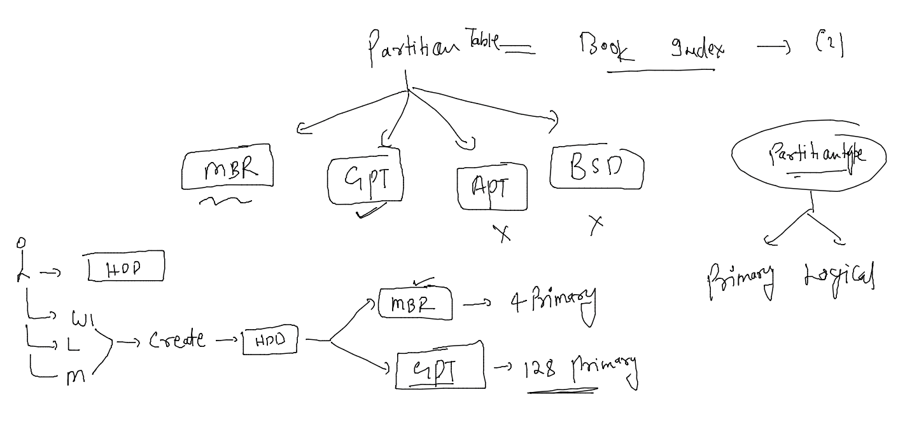
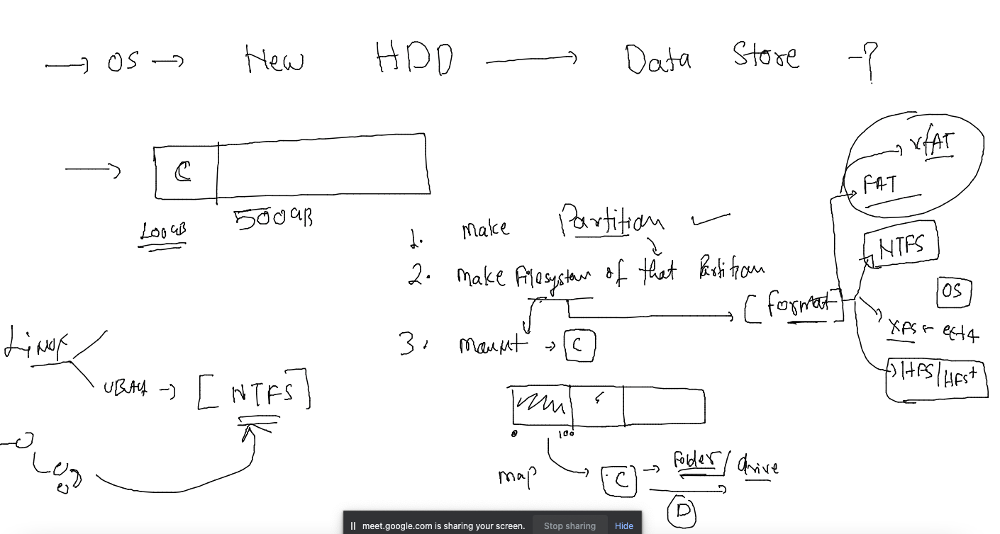

# devops-25ujne2022

### Linux target 

### aws cloud target 

## Introduction to storage 

### sector in Hard disk 

### partition concepts 

### partition creation concept 

###  using hard disk in any OS 

### understanding about Udev in LInux 

