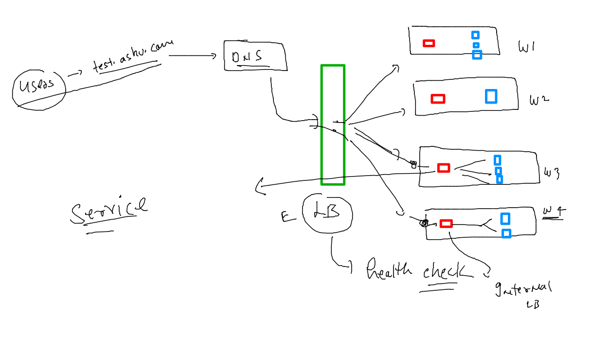
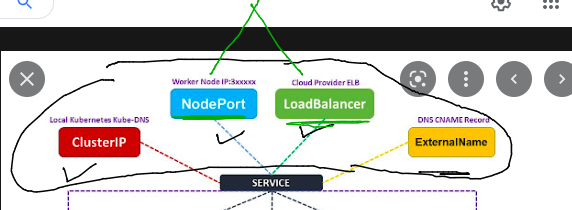

# devops-25ujne2022

### Linux target 


### aws cloud target 


## Intro to service 



### type of service 



### creating nodeport service 

```
fire@ashutoshhs-MacBook-Air kubernetes % kubectl  create  service 
Create a service using a specified subcommand.

Aliases:
service, svc

Available Commands:
  clusterip      Create a ClusterIP service
  externalname   Create an ExternalName service
  loadbalancer   Create a LoadBalancer service
  nodeport       Create a NodePort service


  ```
  ### -- service yaml
  
  ```
  fire@ashutoshhs-MacBook-Air kubernetes % kubectl  create  service   nodeport ashusvc12 --tcp  1234:80 --dry-run=client -o yaml                   
apiVersion: v1
kind: Service
metadata:
  creationTimestamp: null
  labels:
    app: ashusvc12
  name: ashusvc12
spec:
  ports:
  - name: 1234-80
    port: 1234
    protocol: TCP
    targetPort: 80
  selector:
    app: ashusvc12
  type: NodePort
status:
  loadBalancer: {}
  ```
  
  ###
  
  ```
  fire@ashutoshhs-MacBook-Air kubernetes % kubectl  create  service   nodeport ashusvc1 --tcp  1234:80 --dry-run=client -o yaml   >nodeportsvc.yaml 
fire@ashutoshhs-MacBook-Air kubernetes % 
fire@ashutoshhs-MacBook-Air kubernetes % 
fire@ashutoshhs-MacBook-Air kubernetes % kubectl apply -f nodeportsvc.yaml 
service/ashusvc1 created
fire@ashutoshhs-MacBook-Air kubernetes % kubectl  get service 
NAME         TYPE        CLUSTER-IP    EXTERNAL-IP   PORT(S)          AGE
ashusvc1     NodePort    10.98.5.144   <none>        1234:30638/TCP   5s
kubernetes   ClusterIP   10.96.0.1     <none>        443/TCP          20d
fire@ashutoshhs-MacBook-Air kubernetes % 

  ```
  
  

