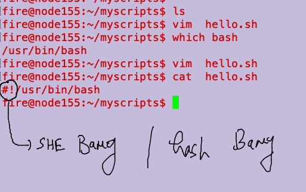

## Understanding scripting 

### view of shell scripting 


### planning shell scripting 

```
fire@node155:~$ whoami
fire
fire@node155:~$ pwd
/home/fire
fire@node155:~$ mkdir  myscripts 
fire@node155:~$ cd myscripts/
fire@node155:~/myscripts$ ls
fire@node155:~/myscripts$ 


```

### understanding she/hash bang



### demo 1 

```
fire@node155:~/myscripts$ cat hello.sh 
#!/usr/bin/bash

date
whoami
pwd
ls
uptime
fire@node155:~/myscripts$ bash hello.sh 
Fri Jul 29 04:40:28 PDT 2022
fire
/home/fire/myscripts
hello.sh
 04:40:28 up 11 days,  7:40,  2 users,  load average: 0.24, 0.66, 0.39
fire@node155:~/myscripts$ 


```

## how to run a shell script 

### method 1

```
fire@node155:~/myscripts$ bash hello.sh 
Fri Jul 29 04:41:27 PDT 2022
fire
/home/fire/myscripts
hello.sh
 04:41:27 up 11 days,  7:41,  2 users,  load average: 0.24, 0.58, 0.38
fire@node155:~/myscripts$ 
```

### method 2

```
fire@node155:~/myscripts$ chmod  +x  hello.sh 
fire@node155:~/myscripts$ 
fire@node155:~/myscripts$ ./hello.sh 
Fri Jul 29 04:41:35 PDT 2022
fire
/home/fire/myscripts
hello.sh
 04:41:35 up 11 days,  7:41,  2 users,  load average: 0.22, 0.57, 0.38
fire@node155:~/myscripts$ 


```

### method 3 (if you have done chmod step then on )

```
fire@node155:~/myscripts$ /home/fire/myscripts/hello.sh 
Fri Jul 29 04:42:46 PDT 2022
fire
/home/fire/myscripts
hello.sh
 04:42:46 up 11 days,  7:42,  2 users,  load average: 0.24, 0.50, 0.36
fire@node155:~/myscripts$
```

### run shell script as command 

```
fire@node155:~/myscripts$ ls
hello.sh
fire@node155:~/myscripts$ echo $PATH
/usr/local/sbin:/usr/local/bin:/usr/sbin:/usr/bin:/sbin:/bin:/usr/games:/usr/local/games:/snap/bin
fire@node155:~/myscripts$ 
fire@node155:~/myscripts$ 
fire@node155:~/myscripts$ 
fire@node155:~/myscripts$ 
fire@node155:~/myscripts$ 
fire@node155:~/myscripts$ sudo cp hello.sh   /usr/bin/ashu
[sudo] password for fire: 
fire@node155:~/myscripts$ 
fire@node155:~/myscripts$ 
fire@node155:~/myscripts$ ashu 
Fri Jul 29 04:43:40 PDT 2022
fire
/home/fire/myscripts
hello.sh
 04:43:40 up 11 days,  7:43,  2 users,  load average: 0.15, 0.43, 0.35
fire@node155:~/myscripts$ 
```


### demo 2

```
fire@node155:~/myscripts$ cat userinput.sh 
#!/usr/bin/bash

echo  "hey please enter any command to run : "

# read is reading user input and storing into some variable 
read  x
sleep 2 
echo "Hey you have entered  $x "
echo "please wait your command is about to RUn : ...>"
sleep 1
$x
fire@node155:~/myscripts$ bash userinput.sh 
hey please enter any command to run : 
uptime
Hey you have entered  uptime 
please wait your command is about to RUn : ...>
 04:51:12 up 11 days,  7:51,  2 users,  load average: 0.09, 0.20, 0.26
fire@node155:~/myscripts$ 


```


### conditional statement 

```
fire@node155:~/myscripts$ cat check.sh 
#!/usr/bin/bash

echo  "hey please enter any command to run : "

# read is reading user input and storing into some variable 
read  x


$x &>/dev/null  
# in linux /dev/null is know as black hole 
status=`echo $?`

echo $status


if [  $status  -eq  0   ]
then 
	echo "you have enterd correct command so please wait "
	sleep 1
	$x

else 
	echo "the command $x you have entered is not correct "

fi 

```
