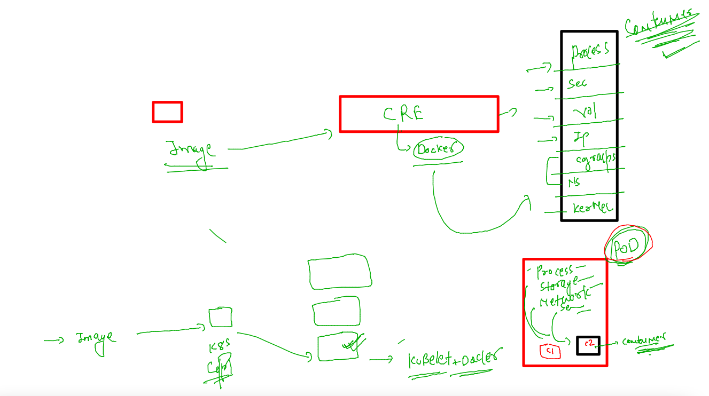
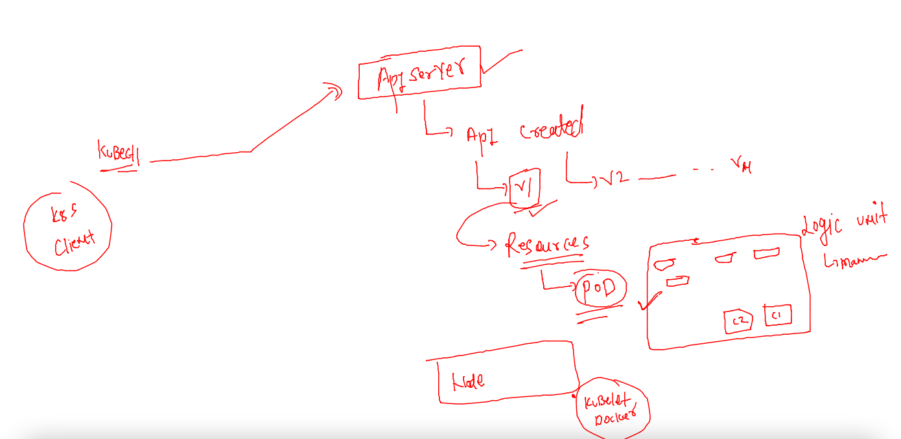
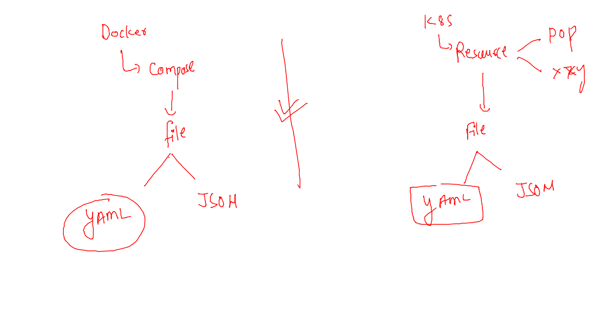
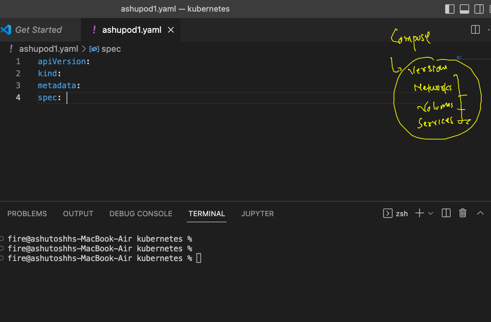

# devops-25ujne2022

### Linux target 


### aws cloud target 


### Introduction to Pod 



### more undertstanding 



### Pod writing 



### Use vscode to wring k8s Resources like POd definition 

[click_here](https://code.visualstudio.com/download)

### a comparasion b/w compose yaml and k8s resources yAML 



### the most small details of Pod 

```
apiVersion: v1  # apiversion to accept some Request 
kind: Pod # name of Resources 
metadata: # info about kind type 
  name: ashupod-1  # name of pod 
spec: # spec will contain all app related Info like containers , network , storage etc.
  containers: 
  - image: alpine 
    name: ashuc1 
    command: ['sh','-c','ping fb.com']
```

### lets deploy pod 

```
fire@ashutoshhs-MacBook-Air kubernetes % kubectl create -f  ashupod1.yaml 
pod/ashupod-1 created
fire@ashutoshhs-MacBook-Air kubernetes % kubectl  get  pods
NAME        READY   STATUS    RESTARTS   AGE
ashupod-1   1/1     Running   0          10s
fire@ashutoshhs-MacBook-Air kubernetes % 
fire@ashutoshhs-MacBook-Air kubernetes % kubectl  get  pods -o wide
NAME        READY   STATUS    RESTARTS   AGE   IP                NODE      NOMINATED NODE   READINESS GATES
ashupod-1   1/1     Running   0          23s   192.168.235.129   worker1   <none>           <none>
fire@ashutoshhs-MacBook-Air kubernetes % 

```

### some more info about pod comamnds 

### More info about pod status 

```
fire@ashutoshhs-MacBook-Air kubernetes % kubectl describe pod ashupod-1
Name:             ashupod-1
Namespace:        default
Priority:         0
Service Account:  default
Node:             worker1/172.31.32.194
Start Time:       Mon, 31 Oct 2022 16:44:52 +0530
Labels:           <none>
Annotations:      cni.projectcalico.org/containerID: 0b17a014bec79f2e2398305fc2f92802a5f5f6949412f36a81d671f3ab4733c9
                  cni.projectcalico.org/podIP: 192.168.235.129/32
                  cni.projectcalico.org/podIPs: 192.168.235.129/32
Status:           Running
IP:               192.168.235.129
IPs:
  IP:  192.168.235.129
Containers:
  ashuc1:
    Container ID:  containerd://ab0b9aed370f2ab37bbe2db676d8fdbafc75904c51670cb92887c8b874c3e051
    Image:         alpine
    Image ID:      docker.io/library/alpine@sha256:bc41182d7ef5ffc53a40b044e725193bc10142a1243f395ee852a8d9730fc2ad
    Port:          <none>
    Host Port:     <none>
    Command:
      sh
      -c
      ping fb.com
    State:          Running
```


### logs 

```
fire@ashutoshhs-MacBook-Air kubernetes % kubectl logs ashupod-1 
PING fb.com (157.240.2.35): 56 data bytes
64 bytes from 157.240.2.35: seq=0 ttl=35 time=211.556 ms
64 bytes from 157.240.2.35: seq=1 ttl=35 time=211.554 ms
64 bytes from 157.240.2.35: seq=2 ttl=35 time=211.768 ms
64 bytes from 157.240.2.35: seq=3 ttl=35 time=211.569 ms
64 bytes from 157.240.2.35: seq=4 ttl=35 time=211.680 ms
64 bytes from 157.240.2.35: seq=5 ttl=35 time=211.573 ms
64 bytes from 157.240.2.35: seq=6 ttl=35 time=211.603 ms
64 bytes from 157.240.2.35: seq=7 ttl=35 time=211.679 ms
64 bytes from 157.240.2.35: seq=8 ttl=35 time=211.636 ms
```

### deleteing pods 

```
 1010  kubectl logs ashupod-1 
fire@ashutoshhs-MacBook-Air kubernetes % kubectl get  pods
NAME        READY   STATUS    RESTARTS   AGE
ashupod-1   1/1     Running   0          2m55s
fire@ashutoshhs-MacBook-Air kubernetes % ls
ashupod1.yaml
fire@ashutoshhs-MacBook-Air kubernetes % kubectl delete -f  ashupod1.yaml 
pod "ashupod-1" deleted
fire@ashutoshhs-MacBook-Air kubernetes % kubectl get  pods               
No resources found in default namespace.
fire@ashutoshhs-MacBook-Air kubernetes % 
```


