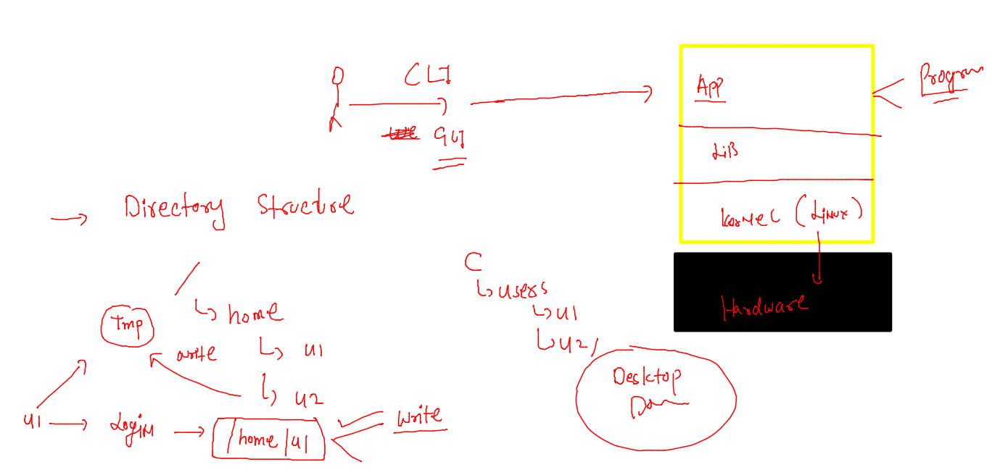
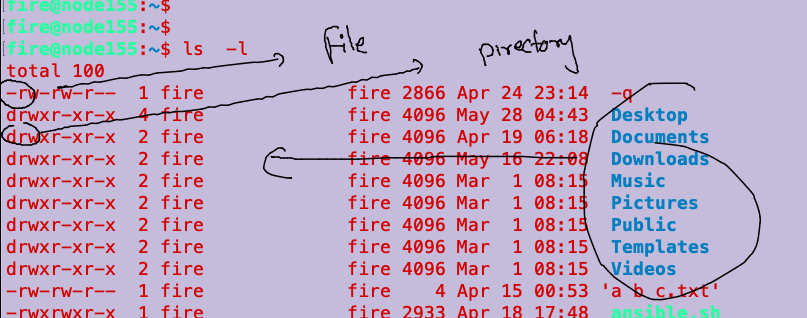
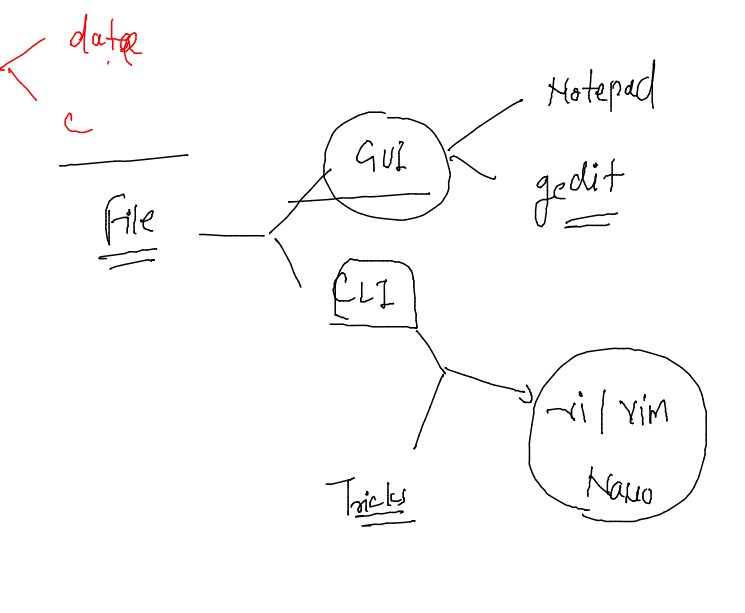
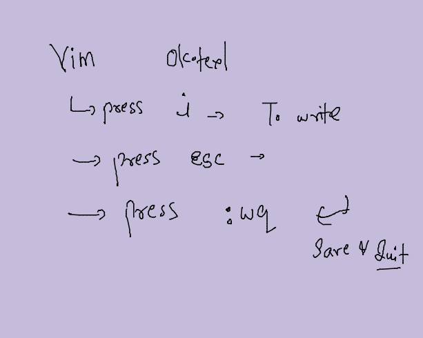

# day 2 Revision 



## Some basic commands 

### info about kernel 

```
uname 
Linux
fire@node155:~$ 

fire@node155:~$ uname  -r
5.13.0-51-generic
fire@node155:~$ 

```

### more commands 

```

fire@node155:~$ date
Mon Jun 27 04:57:28 PDT 2022
fire@node155:~$ cal
     June 2022        
Su Mo Tu We Th Fr Sa  
          1  2  3  4  
 5  6  7  8  9 10 11  
12 13 14 15 16 17 18  
19 20 21 22 23 24 25  
26 27 28 29 30        
                      
fire@node155:~$ pwd
/home/fire
fire@node155:~$ whoami
fire
fire@node155:~$ ls
 -q          Downloads   Public     'a b c.txt'   config   githubtoke.txt   rc.yaml    snap
 Desktop     Music       Templates   ansible.sh   db1      images           rs.yaml    website
 Documents   Pictures    Videos      ashu.key     files    istio-1.13.4     rs1.yaml
fire@node155:~$ 


```

### file vs folder 



### creation of files 



### method 1

```
 >hiii.txt
fire@node155:/tmp/ashu$ ls
hiii.txt
fire@node155:/tmp/ashu$ ls -l
total 0
-rw-rw-r-- 1 fire fire 0 Jun 27 05:04 hiii.txt

```

### remove files 

```
 rm hiii.txt 
```

### vim 



### to read data of afile 

```
cat  ok.txt 
hello guys how are you ..?

all good ..?

```

### checking os name 

```
 cat  /etc/os-release  
NAME="Ubuntu"
VERSION="20.04.3 LTS (Focal Fossa)"
ID=ubuntu
ID_LIKE=debian
PRETTY_NAME="Ubuntu 20.04.3 LTS"
VERSION_ID="20.04"

```


