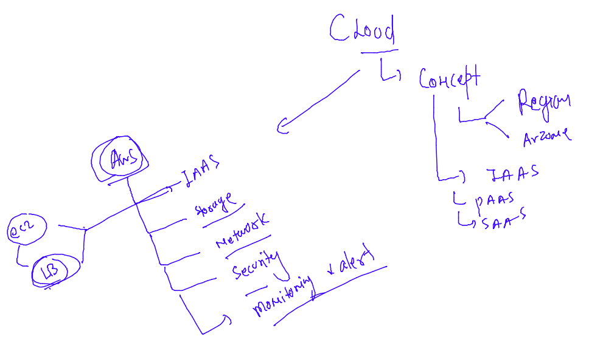

## TIps 

### alias in shell

```
ubuntu@ip-172-31-13-150:~$ date  +%Y
2022
ubuntu@ip-172-31-13-150:~$ alias  year="date +%Y"
ubuntu@ip-172-31-13-150:~$ 
ubuntu@ip-172-31-13-150:~$ 
ubuntu@ip-172-31-13-150:~$ year 
2022
ubuntu@ip-172-31-13-150:~$ 
```

### CLoud computing 



