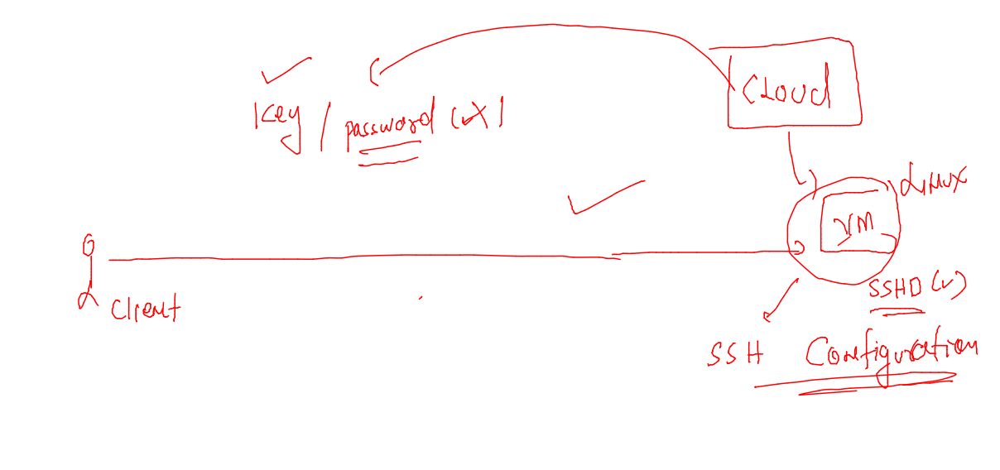
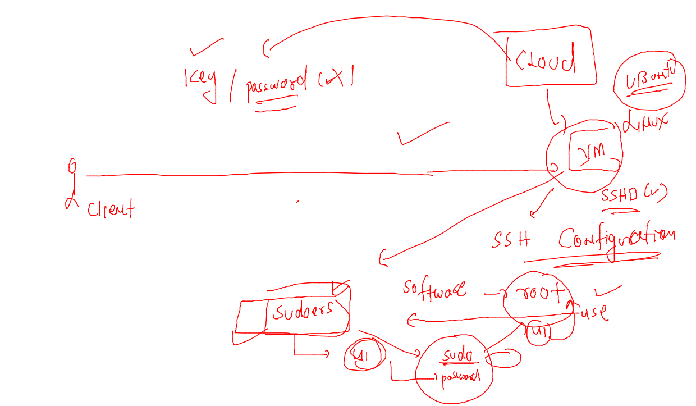

# devops-25ujne2022

### connecting vm from cmd / powershell / terminal 

```
fire@ashutoshhs-MacBook-Air ~ % cd Downloads 
fire@ashutoshhs-MacBook-Air Downloads % chmod 600 ashutest.pem 
fire@ashutoshhs-MacBook-Air Downloads % 
fire@ashutoshhs-MacBook-Air Downloads % 
fire@ashutoshhs-MacBook-Air Downloads % ssh -i ashutest.pem  ubuntu@43.205.103.17
The authenticity of host '43.205.103.17 (43.205.103.17)' can't be established.
ECDSA key fingerprint is SHA256:iUySFeXNDpbnMKqOfHmpQSjXuh2lfv8wQvUrZQrP8Jg.
Are you sure you want to continue connecting (yes/no/[fingerprint])? yes
Warning: Permanently added '43.205.103.17' (ECDSA) to the list of known hosts.
Welcome to Ubuntu 20.04.4 LTS (GNU/Linux 5.13.0-1029-aws x86_64)


```

### By default aws cloud doesn't support password based ssh access for linux vm 



### we need to modify ssh configuration in cloud vm 

```
root@ip-172-31-28-242:~# cd /etc/ssh/
root@ip-172-31-28-242:/etc/ssh# ls
moduli        ssh_host_dsa_key      ssh_host_ecdsa_key.pub    ssh_host_rsa_key      sshd_config
ssh_config    ssh_host_dsa_key.pub  ssh_host_ed25519_key      ssh_host_rsa_key.pub  sshd_config.d
ssh_config.d  ssh_host_ecdsa_key    ssh_host_ed25519_key.pub  ssh_import_id
root@ip-172-31-28-242:/etc/ssh# vim  sshd_config
root@ip-172-31-28-242:/etc/ssh# grep -in passwordauthenitcation sshd_config
root@ip-172-31-28-242:/etc/ssh# grep -in passwordauthentication  sshd_config
58:PasswordAuthentication yes
80:# PasswordAuthentication.  Depending on your PAM configuration,
84:# PAM authentication, then enable this but set PasswordAuthentication
root@ip-172-31-28-242:/etc/ssh# 
root@ip-172-31-28-242:/etc/ssh# systemctl restart sshd
root@ip-172-31-28-242:/etc/ssh# 

```

### Before changing client wast not able to connect 

```
fire@ashutoshhs-MacBook-Air ~ % ssh  hellocloud@43.205.103.17
hellocloud@43.205.103.17: Permission denied (publickey).
fire@ashutoshhs-MacBook-Air ~ % 


```

### after changing in vm sshd file 

```
fire@ashutoshhs-MacBook-Air ~ % ssh  hellocloud@43.205.103.17
hellocloud@43.205.103.17's password: 
Welcome to Ubuntu 20.04.4 LTS (GNU/Linux 5.13.0-1029-aws x86_64)

 * Documentation:  https://help.ubuntu.com
 * Management:     https://landscape.canonical.com
 * Support:        https://ubuntu.com/advantage

  System information as 
```

### Understanding sudoers in linux 



### adding user into sudoers 

```
ubuntu@ip-172-31-28-242:~$ sudo -i
root@ip-172-31-28-242:~# 
root@ip-172-31-28-242:~# 
root@ip-172-31-28-242:~# cd  /etc/sudoers.d/
root@ip-172-31-28-242:/etc/sudoers.d# ls
90-cloud-init-users  README
root@ip-172-31-28-242:/etc/sudoers.d# cat  90-cloud-init-users 
# Created by cloud-init v. 22.2-0ubuntu1~20.04.1 on Thu, 21 Jul 2022 11:42:13 +0000

# User rules for ubuntu
ubuntu ALL=(ALL) NOPASSWD:ALL
root@ip-172-31-28-242:/etc/sudoers.d# vim 90-cloud-init-users 
root@ip-172-31-28-242:/etc/sudoers.d# cat  90-cloud-init-users 
# Created by cloud-init v. 22.2-0ubuntu1~20.04.1 on Thu, 21 Jul 2022 11:42:13 +0000

# User rules for ubuntu
ubuntu ALL=(ALL) NOPASSWD:ALL
hellocloud  ALL=(ALL) NOPASSWD:ALL
root@ip-172-31-28-242:/etc/sudoers.d# 


```

