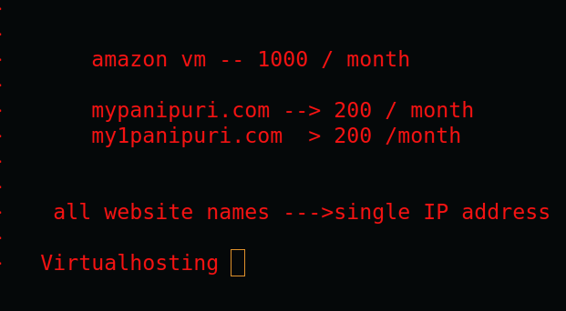

## How to setup apache httpd web server in amaazon LInux over ec2 

### step 1 

```
yum install httpd  git 
```

### step 2 download some sample code from Github 

```
git clone https://github.com/schoolofdevops/html-sample-app

```

### step 3  copy code of website to apache httpd server locaiton 

```
[root@ip-172-31-17-34 ~]# cp -rf  html-sample-app/*   /var/www/html/
[root@ip-172-31-17-34 ~]# 
[root@ip-172-31-17-34 ~]# 
[root@ip-172-31-17-34 ~]# cd  /var/www/html/
[root@ip-172-31-17-34 html]# ls
assets         generic.html         images      LICENSE.txt
elements.html  html5up-phantom.zip  index.html  README.txt
[root@ip-172-31-17-34 html]# 


```

### final step to start httpd server service 

```
root@ip-172-31-17-34 html]# systemctl start  httpd
[root@ip-172-31-17-34 html]# systemctl status  httpd
● httpd.service - The Apache HTTP Server
   Loaded: loaded (/usr/lib/systemd/system/httpd.service; disabled; vendor preset: disabled)
   Active: active (running) since Sun 2022-07-24 05:26:04 UTC; 11s ago
     Docs: man:httpd.service(8)
 Main PID: 4677 (ht
```
### Understanding Virtualhosting 



### creating folder under /var/www/  with the name of customers  and copy their website 

```
 21  git clone https://github.com/microsoft/project-html-website
   22  ls
   23  git clone https://github.com/yenchiah/project-website-template
   24  ls
   25  ls html-sample-app/
   26  ls  project-html-website/
   27  cd  /var/www/
   28  ls
   29  mkdir  ashu
   30  ls
   31  mkdir mrinal 
   32  ls
   33  mkdir  bhupesh 
   34  ls
   35  cd
   36  ls
   37  cp -rf html-sample-app/*  /var/www/bhupesh/
   38  cp -rf  project-html-website/*  /var/www/mrinal/
   39  cp -rf  project-website-template/*  /var/www/ashu/

```

###  now configure virtual hosting 

```
[root@ip-172-31-17-34 html]# cd /etc/httpd/conf.d/
[root@ip-172-31-17-34 conf.d]# ls
ashu.conf       bhupesh.conf  mrinal.conf  userdir.conf
autoindex.conf  default.conf  README       welcome.conf
[root@ip-172-31-17-34 conf.d]# cat  ashu.conf 
<virtualhost  *:80>
servername  www.ashu.com
documentroot  /var/www/ashu/
</virtualhost>

```

### for others like bhupesh 

```
root@ip-172-31-17-34 conf.d]# cat bhupesh.conf 
<virtualhost *:80>
servername  www.bhupesh.com
documentroot  /var/www/bhupesh/
</virtualhost>

```

### restart httpd service 

```
[root@ip-172-31-17-34 conf.d]# systemctl restart httpd 
[root@ip-172-31-17-34 conf.d]# systemctl status  httpd 
● httpd.service - The Apache HTTP Server
   Loaded: loaded (/usr/lib/systemd/system/httpd.service; disabled; vendor preset: disabled)
   Active: active (running) since Sun 2022-07-24 06:35:37 UTC; 5s ago
     Docs: man:httpd.service(8)
 Main PID: 2759 (httpd)
   Status: "Processing r
```

