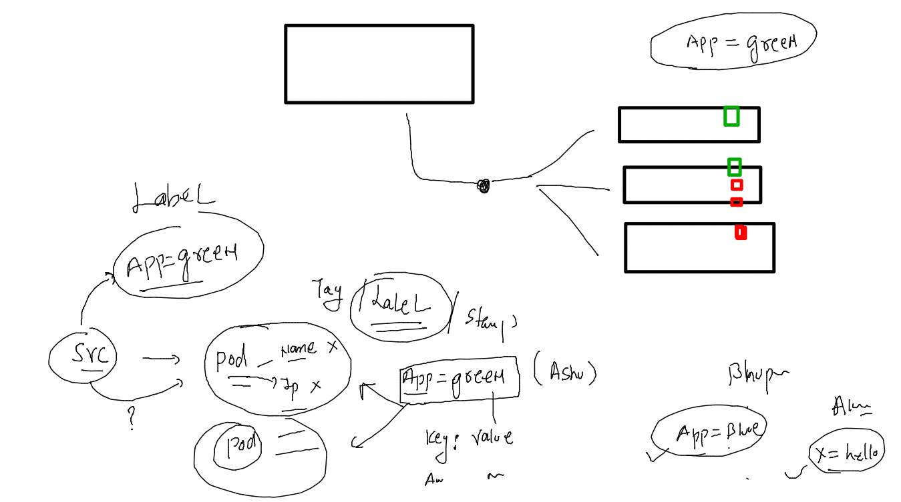
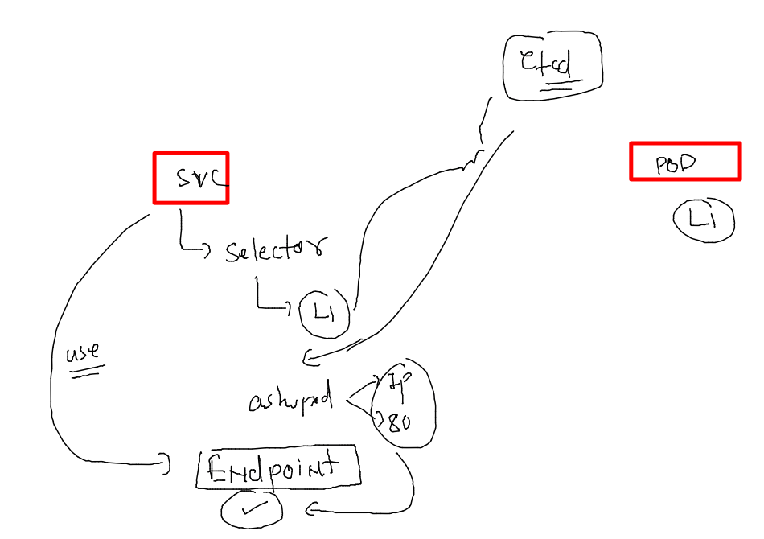

# devops-25ujne2022

### Linux target 


### aws cloud target 


### service will use label of pod to find its numbers 



### POd YAML With custom label 

```
cat  /tmp/webapp.yaml
apiVersion: v1
kind: Pod
metadata:
  creationTimestamp: null
  labels:
    app: green
  name: ashuwebapp
spec:
  containers:
  - image: nginx
    name: ashuwebapp
    ports:
    - containerPort: 80
    resources: {}
  dnsPolicy: ClusterFirst
  restartPolicy: Always
status: {}


```

### lets change it 

```
fire@ashutoshhs-MacBook-Air ~ % kubectl replace -f /tmp/webapp.yaml --force 
pod "ashuwebapp" deleted
pod/ashuwebapp replaced
fire@ashutoshhs-MacBook-Air ~ % kubectl  get  po --show-labels 
NAME         READY   STATUS    RESTARTS      AGE   LABELS
akpod5       1/1     Running   1 (10m ago)   23h   <none>
ashuwebapp   1/1     Running   0             11s   app=green
karanpod1    1/1     Running   2 (10m ago)   7d    <none>
fire@ashutoshhs-MacBook-Air ~ % 

```

### service will be EP to store pod ip:port info from etcd 



### service and pod 

```
fire@ashutoshhs-MacBook-Air ~ % kubectl apply -f  Desktop/kubernetes/nodeportsvc.yaml 
service/ashusvc1 configured
fire@ashutoshhs-MacBook-Air ~ % 
fire@ashutoshhs-MacBook-Air ~ % kubectl get svc -o wide
NAME         TYPE        CLUSTER-IP    EXTERNAL-IP   PORT(S)          AGE   SELECTOR
ashusvc1     NodePort    10.98.5.144   <none>        1234:30638/TCP   23h   app=green
kubernetes   ClusterIP   10.96.0.1     <none>        443/TCP          21d   <none>
fire@ashutoshhs-MacBook-Air ~ % 
fire@ashutoshhs-MacBook-Air ~ % kubectl  get  endpoints 
NAME         ENDPOINTS           AGE
ashusvc1     192.168.189.71:80   23h
kubernetes   172.31.38.68:6443   21d
fire@ashutoshhs-MacBook-Air ~ % kubectl  get po --show-labels
NAME         READY   STATUS    RESTARTS      AGE     LABELS
akpod5       1/1     Running   1 (16m ago)   23h     <none>
ashuwebapp   1/1     Running   0             6m23s   app=green
karanpod1    1/1     Running   2 (16m ago)   7d      <none>
fire@ashutoshhs-MacBook-Air ~ % kubectl  get po --show-labels -owide
NAME         READY   STATUS    RESTARTS      AGE     IP                NODE      NOMINATED NODE   READINESS GATES   LABELS
akpod5       1/1     Running   1 (16m ago)   23h     192.168.189.70    worker2   <none>           <none>            <none>
ashuwebapp   1/1     Running   0             6m27s   192.168.189.71    worker2   <none>           <none>            app=green
karanpod1    1/1     Running   2 (16m ago)   7d      192.168.235.132   worker1   <none>           <none>            <none>
fire@ashutoshhs-MacBook-Air ~ % 

```

### yaml 

```
fire@ashutoshhs-MacBook-Air ~ % cat Desktop/kubernetes/nodeportsvc.yaml 
apiVersion: v1
kind: Service
metadata:
  creationTimestamp: null
  labels:
    app: ashusvc1
  name: ashusvc1
spec:
  ports:
  - name: 1234-80
    port: 1234
    protocol: TCP
    targetPort: 80
  selector: # this must have label of pod
    app: green
  type: NodePort
status:
  loadBalancer: {}
fire@ashutoshhs-MacBook-Air ~ %
```


