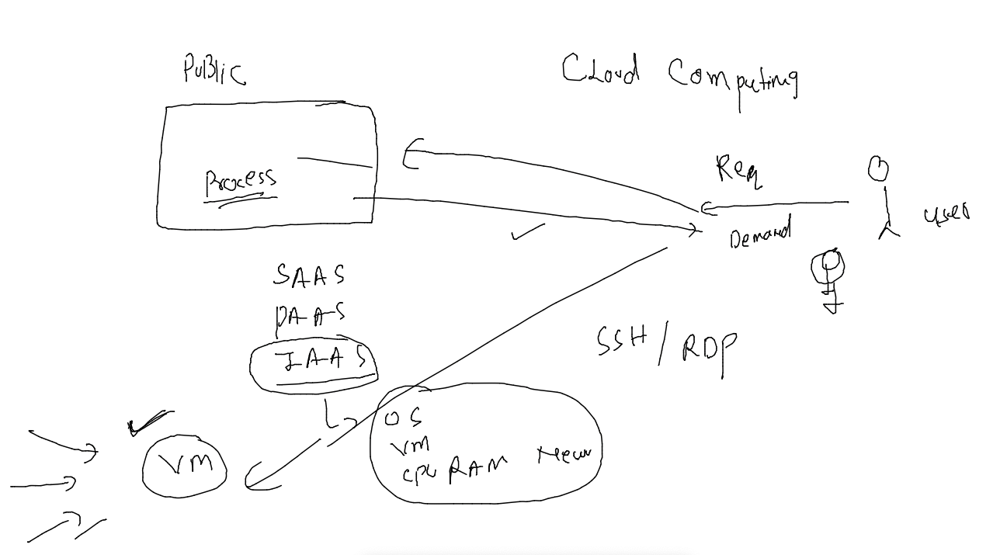
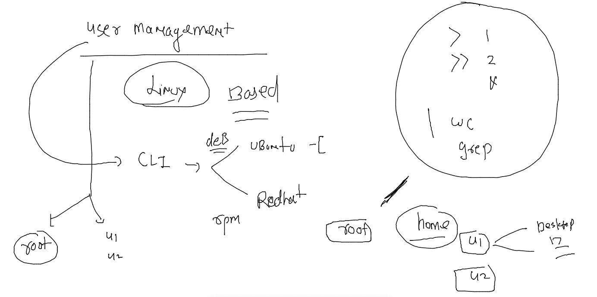
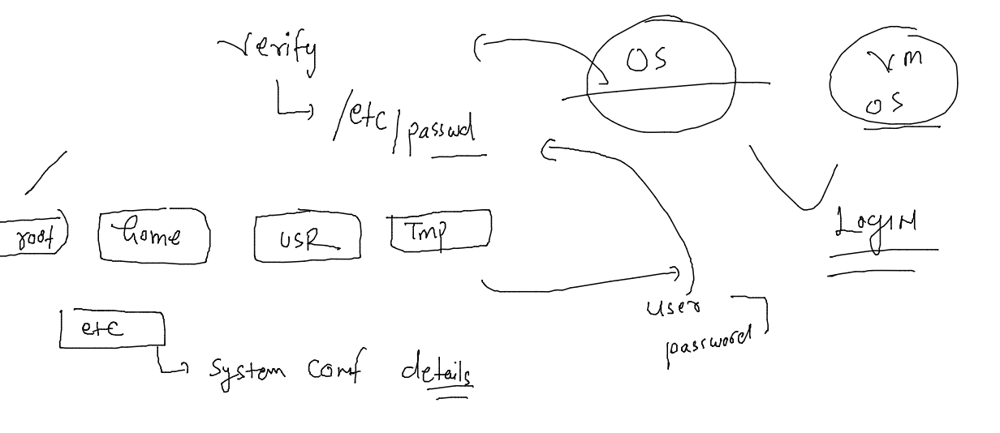
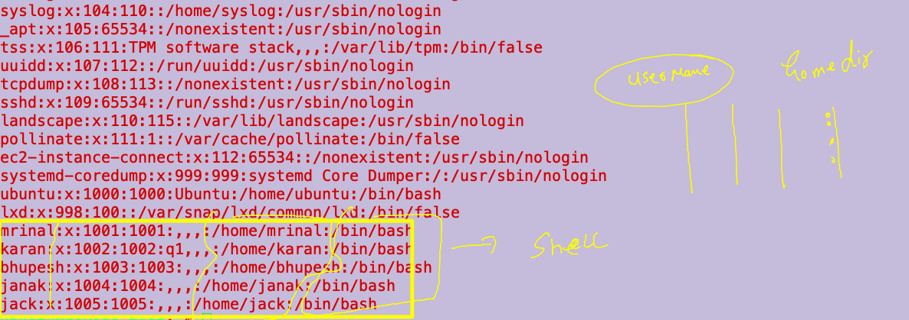

# devops-25ujne2022

### IAAS in CLoud 



### user management 



###. check home directory concept 

```
root@devops-test:~# whoami
root
root@devops-test:~# pwd
/root
root@devops-test:~# ls  /
bin   dev  home  lib32  libx32      media  opt   root  sbin  srv  tmp  var
boot  etc  lib   lib64  lost+found  mnt    proc  run   snap  sys  usr
root@devops-test:~# ls  /home/
bhupesh  janak  karan  mrinal  ubuntu
root@devops-test:~# ls /root/
snap
root@devops-test:~# su - bhupesh 
=hello to linux: command not found
bhupesh@devops-test:~$ whoami 
bhupesh
bhupesh@devops-test:~$ pwd
/home/bhupesh
bhupesh@devops-test:~$ 

```

### adding user 

```
ubuntu@devops-test:~$ adduser  jack 
adduser: Only root may add a user or group to the system.
```

###

```
ubuntu@devops-test:~$ sudo adduser  jack 
Adding user `jack' ...
Adding new group `jack' (1005) ...
Adding new user `jack' (1005) with group `jack' ...
Creating home directory `/home/jack' ...
Copying files from `/etc/skel' ...
New password: 
Retype new password: 
passwd: password updated successfully
Changing the user information for jack
Enter the new value, or press ENTER for the default
	Full Name []: 
	Room Number []: 
	Work Phone []: 
	Home Phone []: 
	Other []: 
Is the information correct? [Y/n] y
```

### importance of /etc directory in LInux 



### user details in /etc/passwd 

```
ubuntu@devops-test:~$ cat  /etc/passwd
root:x:0:0:root:/root:/bin/bash
daemon:x:1:1:daemon:/usr/sbin:/usr/sbin/nologin
bin:x:2:2:bin:/bin:/usr/sbin/nologin
sys:x:3:3:sys:/dev:/usr/sbin/nologin
sync:x:4:65534:sync:/bin:/bin/sync
games:x:5:60:games:/usr/games:/usr/sbin/nologin
man:x:6:12:man:/var/cache/man:/usr/sbin/nologin
lp:x:7:7:lp:/var/spool/lpd:/usr/sbin/nologin
mail:x:8:8:mail:/var/mail:
```

### more details 



