# devops-25ujne2022

### Linux target 

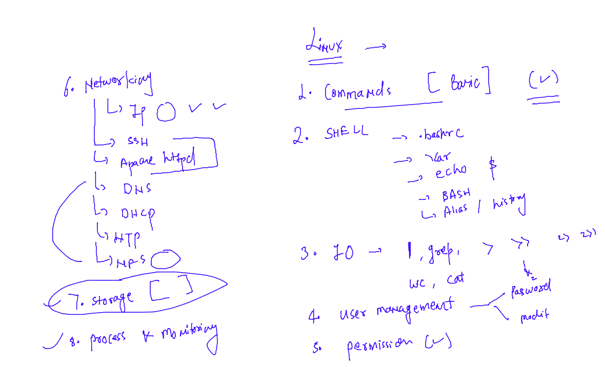

### aws cloud target 

## application deployment problem in History 

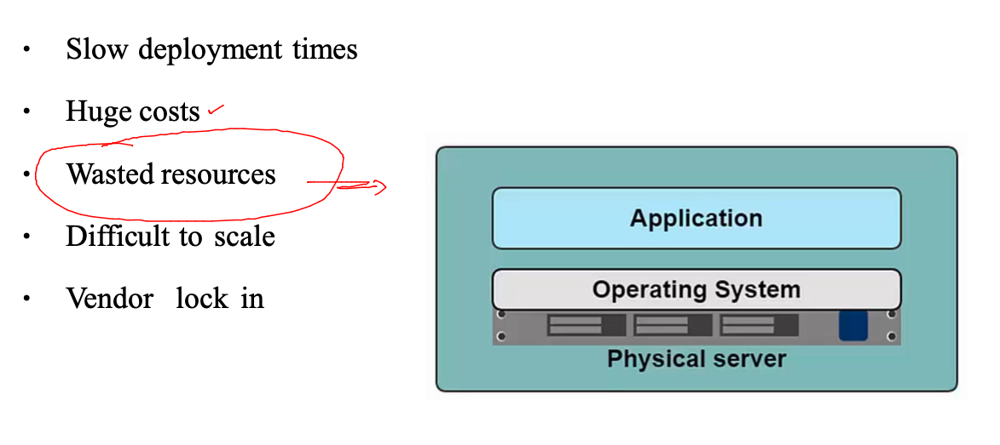

## Introduction to Virtualization 

### Understanding solution of waste of resources 

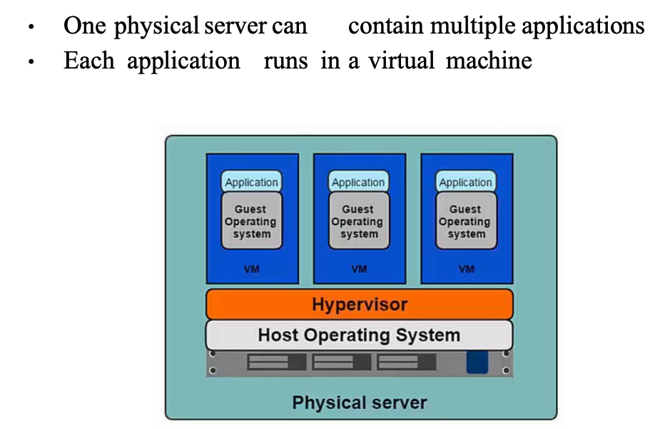

### Understanding type of hypervisor 

### Hosted hypervisor 

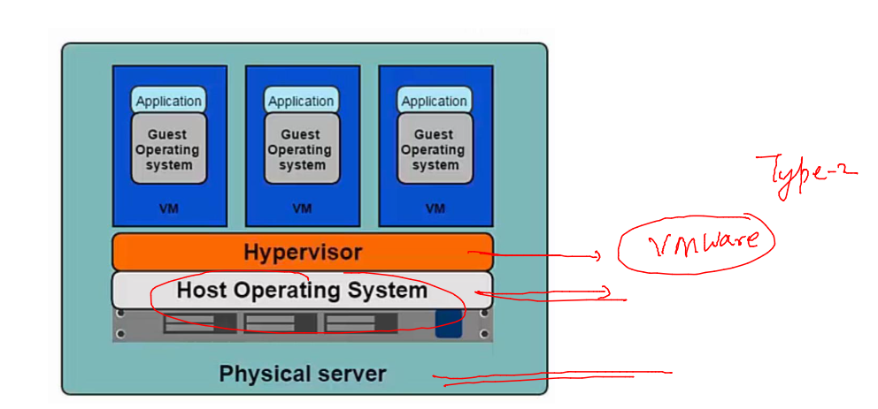

### nativ hypervisor 

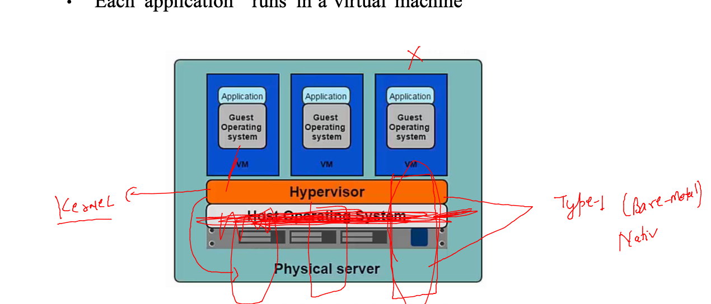

## type of hypervisor 

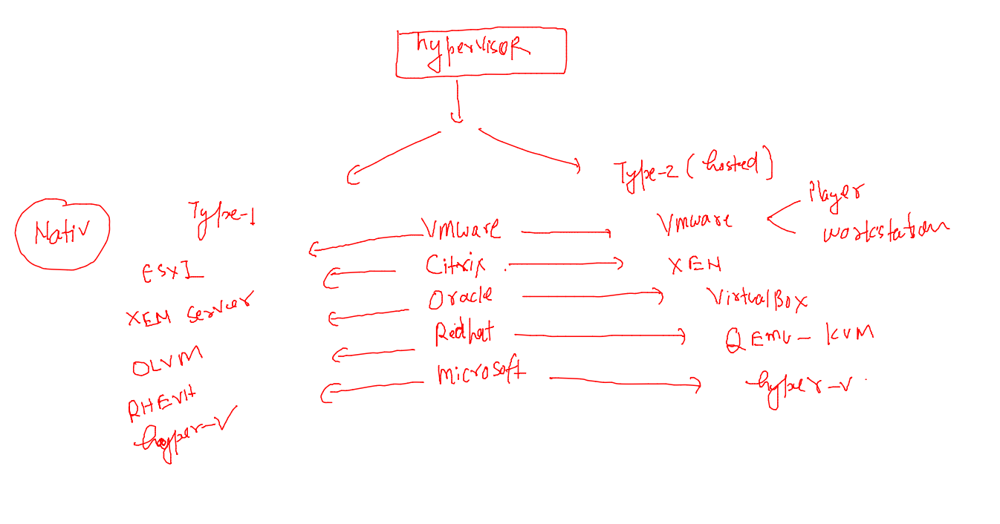

### problem with Vm model 

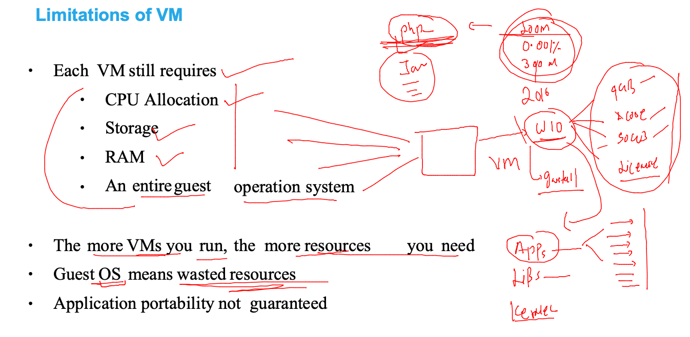

## Introduction to containerization 

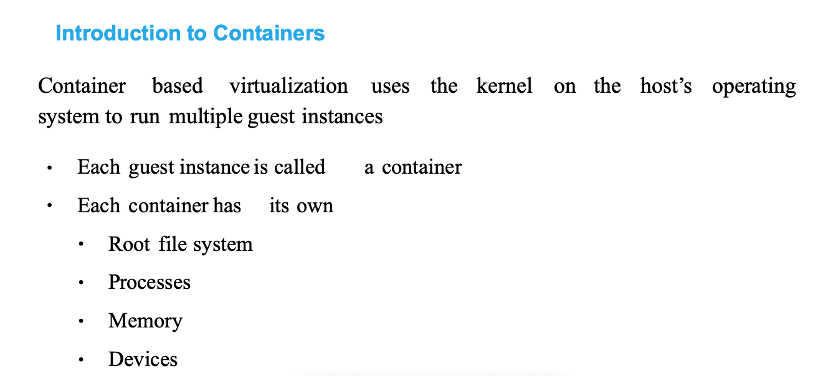

### container uses host kernel 

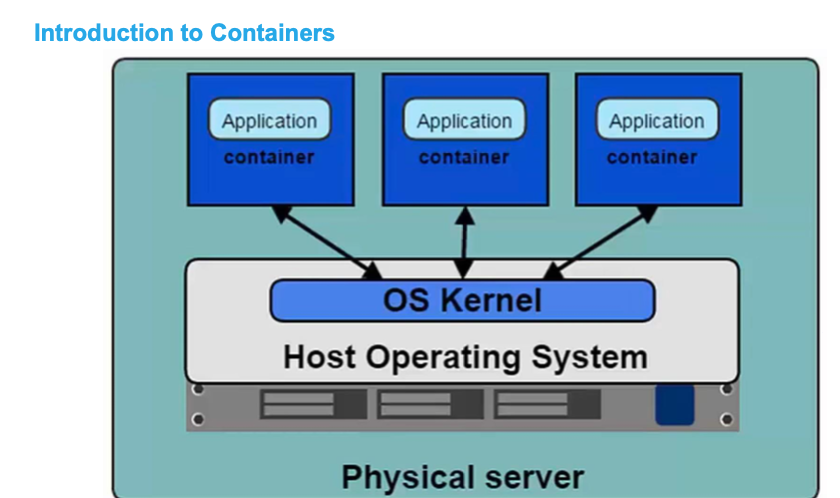

### vm vs container 

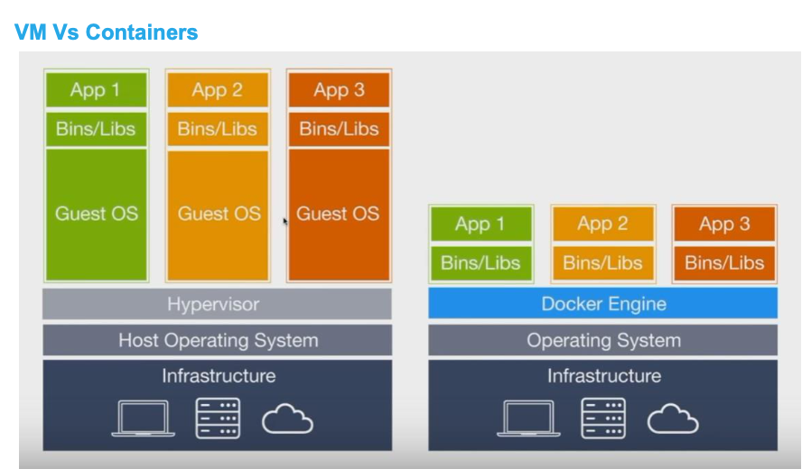

## COntainer runtime Engines (CRE)

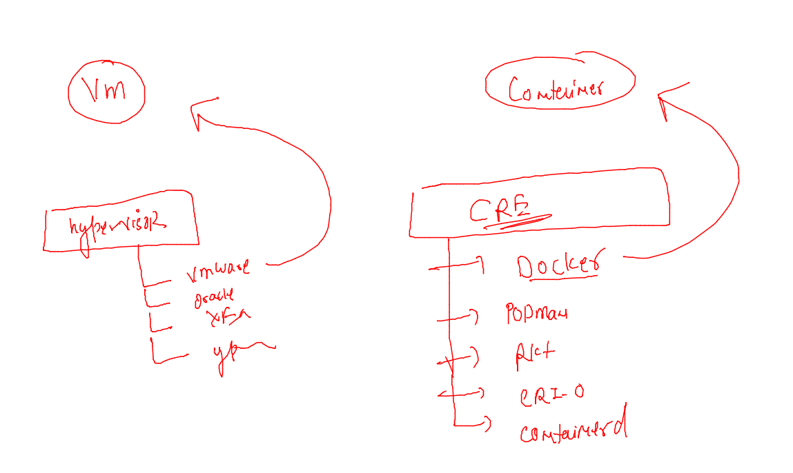

### Introduction to Docker 

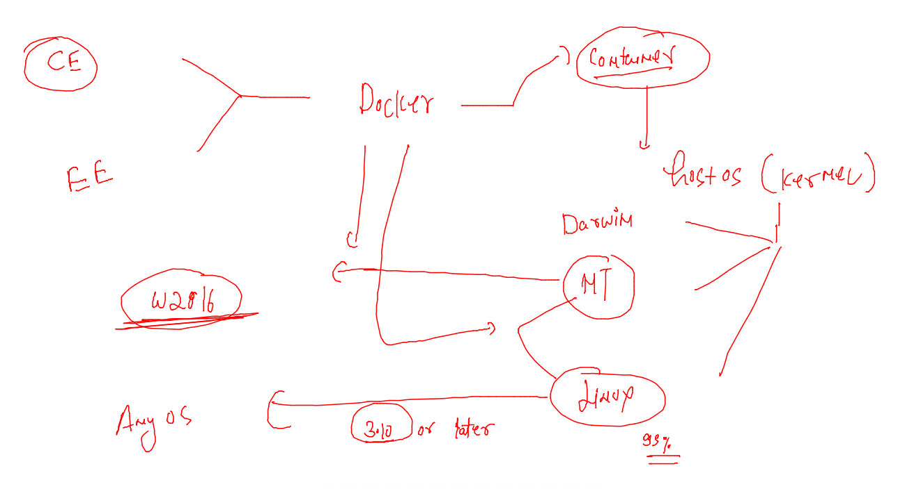

