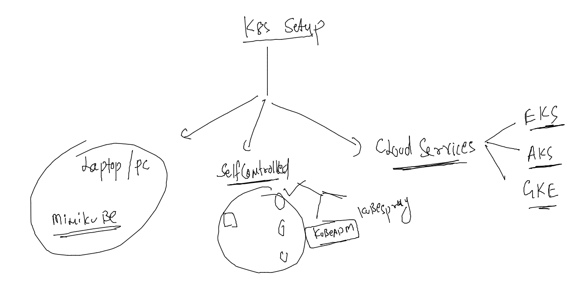

# devops-25ujne2022

### Linux target 


### aws cloud target 


## k8s setup 



## step to perform in all the vm 

```
[root@control-plane ~]# cat setup.sh 
#!/bin/bash

 modprobe br_netfilter
  echo '1' > /proc/sys/net/bridge/bridge-nf-call-iptables
  swapoff  -a

 cat  <<EOF  >/etc/yum.repos.d/kube.repo
[kube]
baseurl=https://packages.cloud.google.com/yum/repos/kubernetes-el7-x86_64
gpgcheck=0
EOF

yum  install  docker kubeadm  -y

cat  <<X  >/etc/docker/daemon.json
{
  "exec-opts": ["native.cgroupdriver=systemd"]
}

X

systemctl enable --now  docker kubelet
```

### give hostname of vm as contropl-plane , worker1 ,worker2 

```
[root@ip-172-31-38-68 ~]# hostnamectl set-hostname control-plane
[root@ip-172-31-38-68 ~]# logout
[ec2-user@ip-172-31-38-68 ~]$ sudo -i
[root@control-plane ~]# 

```

### lets run the script in all 3 vms 

```
bash setup.sh 
```

### steps to perform only in master / control-plane 

```
[root@control-plane ~]# kubeadm init --pod-network-cidr=192.168.0.0/16 --apiserver-advertise-address=0.0.0.0   --apiserver-cert-extra-sans=3.111.75.5
[init] Using Kubernetes version: v1.25.3
[preflight] Running pre-flight checks
	[WARN
```

### after waiting for 2 minutes it will show below given output 

```
Your Kubernetes control-plane has initialized successfully!

To start using your cluster, you need to run the following as a regular user:

  mkdir -p $HOME/.kube
  sudo cp -i /etc/kubernetes/admin.conf $HOME/.kube/config
  sudo chown $(id -u):$(id -g) $HOME/.kube/config

Alternatively, if you are the root user, you can run:

  export KUBECONFIG=/etc/kubernetes/admin.conf

You should now deploy a pod network to the cluster.
Run "kubectl apply -f [podnetwork].yaml" with one of the options listed at:
  https://kubernetes.io/docs/concepts/cluster-administration/addons/

Then you can join any number of worker nodes by running the following on each as root:

kubeadm join 172.31.38.68:6443 --token uzhk5v.71zgcxv4s9srrx19 \
	--discovery-token-ca-cert-hash sha256:e6d4a57e7276ff3ae4ab3e06ce1f8f730b66d656aa891b4bb0f3600c4cc3533b 
[root@control-plane ~]# 

```

### also perform on master 

```
[root@control-plane ~]# mkdir -p $HOME/.kube
[root@control-plane ~]#  cp -i /etc/kubernetes/admin.conf $HOME/.kube/config
[root@control-plane ~]# 

```

### perform on worker from output of master node 

```

Then you can join any number of worker nodes by running the following on each as root:

kubeadm join 172.31.38.68:6443 --token uzhk5v.71zgcxv4s9srrx19 \
	--discovery-token-ca-cert-hash sha256:e6d4a57e72
```

### now to check from master node 

```
[root@control-plane ~]# kubectl  get nodes
NAME            STATUS     ROLES           AGE     VERSION
control-plane   NotReady   control-plane   3m31s   v1.25.3
worker1         NotReady   <none>          60s     v1.25.3
worker2         NotReady   <none>          73s     v1.25.3
[root@control-plane ~]# 


```

### on master system 

```
[root@control-plane ~]# wget https://docs.projectcalico.org/manifests/calico.yaml
--2022-10-18 11:31:10--  https://docs.projectcalico.org/manifests/calico.yaml
Resolving docs.projectcalico.org (docs.projectcalico.org)... 18.140.226.100, 34.143.223.220, 2406:da18:880:3800:1655:e904:cce5:66a5, ...
Connecting to docs.projectcalico.org (docs.projectcalico.org)|18.140.226.100|:443... connected.
HTTP request sent, awaiting response... 200 OK
Length: 235192 (230K) [text/yaml]
Saving to: 'calico.yaml'

100%[=================================================================================>] 235,192      700KB/s   in 0.3s   

2022-10-18 11:31:11 (700 KB/s) - 'calico.yaml' saved [235192/235192]

[root@control-plane ~]# kubectl apply -f calico.yaml 
poddisruptionbudget.policy/calico-kube-controllers created
serviceaccount/calico-kube-controllers created
serviceaccount/calico-node created
configmap/calico-config created
customresourcedefinition.apiextensions.k8s.io/bgpconfigurations.crd.projectcalico.org created
customresourcedefinition.apiextensions.k8s.io/bgppeers.crd.projectcalico.org created

```

### 

```
[root@control-plane ~]# kubectl  get nodes
NAME            STATUS   ROLES           AGE     VERSION
control-plane   Ready    control-plane   4m37s   v1.25.3
worker1         Ready    <none>          2m6s    v1.25.3
worker2         Ready    <none>          2m19s   v1.25.3
```
