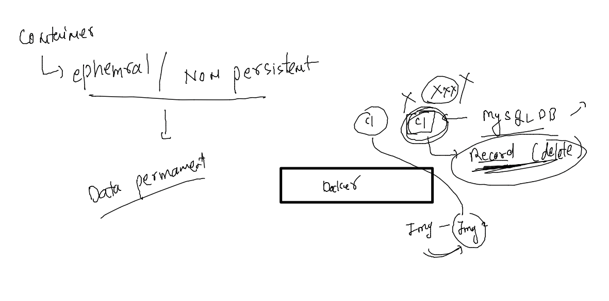
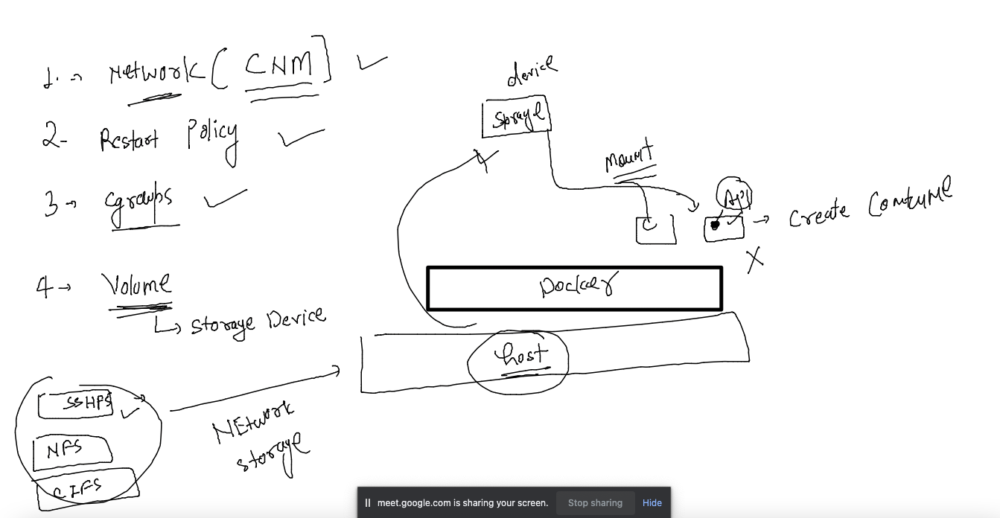

# devops-25ujne2022

### Linux target 


### aws cloud target 


### Understanding container ephemral nature 



### demo 

```
[ec2-user@ip-172-31-91-220 ~]$ docker  exec -it ashuc10  sh 
/ # ls
bin    dev    etc    home   lib    media  mnt    opt    proc   root   run    sbin   srv    sys    tmp    usr    var
/ # mkdir hello world this is me 
/ # ls
bin    etc    home   lib    media  opt    root   sbin   sys    tmp    var
dev    hello  is     me     mnt    proc   run    srv    this   usr    world
/ # exit
[ec2-user@ip-172-31-91-220 ~]$ docker  rm ashu10 -f 
Error: No such container: ashu10
[ec2-user@ip-172-31-91-220 ~]$ docker  rm ashuc10 -f 
ashuc10
[ec2-user@ip-172-31-91-220 ~]$ docker  run -itd --name ashuc10 --memory 200M --cpuset-cpus=0 --cpu-shares=200  alpine 
8dac80f5dab9eb3b0f48b1d2ca2422a20b4a92d6eb567dda0fecaae612e29f47
[ec2-user@ip-172-31-91-220 ~]$ 
[ec2-user@ip-172-31-91-220 ~]$ docker  exec -it ashuc10  sh 
/ # ls
bin    dev    etc    home   lib    media  mnt    opt    proc   root   run    sbin   srv    sys    tmp    usr    var
/ # 
[ec2-user@ip-172-31-91-220 ~]$ 


```

## Docker volume concept 



### creating volume 

```
[ec2-user@ip-172-31-91-220 ~]$ docker  volume  create  ashuvol10 
ashuvol10
[ec2-user@ip-172-31-91-220 ~]$ docker  volume  ls
DRIVER    VOLUME NAME
local     ashuvol10
[ec2-user@ip-172-31-91-220 ~]$ docker  volume  inspect  ashuvol10 
[
    {
        "CreatedAt": "2022-10-06T11:47:33Z",
        "Driver": "local",
        "Labels": {},
        "Mountpoint": "/var/lib/docker/volumes/ashuvol10/_data",
        "Name": "ashuvol10",
        "Options": {},
        "Scope": "local"
    }
]
[ec2-user@ip-172-31-91-220 ~]$ 
```

### creating container with volume 

```
   39  docker  run -itd --name ashuc10 --memory 200M --cpuset-cpus=0 --cpu-shares=200 -v  ashuvol10:/mnt/data  alpine 
   40  history 
[ec2-user@ip-172-31-91-220 ~]$ docker  exec -it ashuc10 sh 
/ # cd  /mnt/
/mnt # ls
data
/mnt # cd data/
/mnt/data # ls
/mnt/data # mkdir hello i am here ; touch a.txt 
/mnt/data # ls
a.txt  am     hello  here   i
/mnt/data # exit
[ec2-user@ip-172-31-91-220 ~]$ docker rm ashuc10 -f 
ashuc10

```

### recheck 

```
[ec2-user@ip-172-31-91-220 ~]$ docker  run -itd --name ashuc10 --memory 200M --cpuset-cpus=0 --cpu-shares=200 -v  ashuvol10:/mnt/data  alpine 
235ba2694cca91307507c83529b2ea446c7add0c038da001fed938e7f50a6164
[ec2-user@ip-172-31-91-220 ~]$ 
[ec2-user@ip-172-31-91-220 ~]$ 
[ec2-user@ip-172-31-91-220 ~]$ docker  exec -it ashuc10 sh 
/ # cd /mnt/data/
/mnt/data # ls
a.txt  am     hello  here   i
/mnt/data # exit

```

### sharing contaienr volume with another container 

```
[ec2-user@ip-172-31-91-220 ~]$ docker run -it --rm -v  ashuvol10:/opt/new  centos 
[root@92adc74e0957 /]# cd /opt/new/
[root@92adc74e0957 new]# ls
a.txt  am  hello  here	i
[root@92adc74e0957 new]# exit
```


