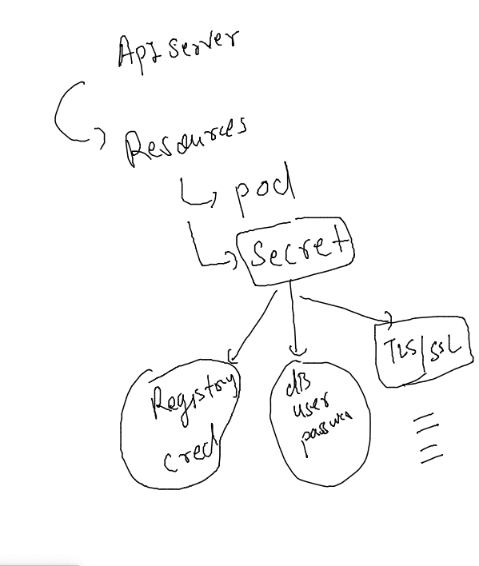
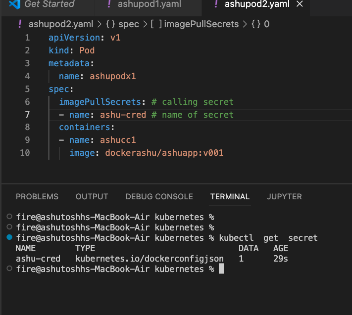

# devops-25ujne2022

### Linux target 


### aws cloud target 


### to pull private imges in k8s cluster we are introducing SEcret resource 



### creating secret 

```
fire@ashutoshhs-MacBook-Air kubernetes % ls
ashupod1.yaml   ashupod2.yaml
fire@ashutoshhs-MacBook-Air kubernetes % kubectl  create  secret 
Create a secret using specified subcommand.

Available Commands:
  docker-registry   Create a secret for use with a Docker registry
  generic           Create a secret from a local file, directory, or literal value
  tls               Create a TLS secret

Usage:
  kubectl create secret [flags] [options]

Use "kubectl <command> --help" for more information about a given command.
Use "kubectl options" for a list of global command-line options (applies to all commands).
fire@ashutoshhs-MacBook-Air kubernetes % 
```

### generating secret yAML 

```
 kubectl  create  secret  docker-registry  ashu-cred --docker-server=docker.io  --docker-username=dockerashu  --docker-password="Xyz@098"  --dry-run=client -o yaml >secret.yaml 
fire@ashutoshhs-MacBook-Air kubernetes % ls
ashupod1.yaml   ashupod2.yaml   secret.yaml
```

### lets create secret 

```
fire@ashutoshhs-MacBook-Air kubernetes % kubectl apply -f secret.yaml 
secret/ashu-cred created
fire@ashutoshhs-MacBook-Air kubernetes % kubectl  get  secret 
NAME        TYPE                             DATA   AGE
ashu-cred   kubernetes.io/dockerconfigjson   1      5s
fire@ashutoshhs-MacBook-Air kubernetes % 

```

### calling secret in Pod YAML file 



### How to generate YAML file automatically 

### creating pod using cli 

```
fire@ashutoshhs-MacBook-Air kubernetes % 
fire@ashutoshhs-MacBook-Air kubernetes % kubectl  run  ashupodx3  --image=nginx  --port 80 
pod/ashupodx3 created
fire@ashutoshhs-MacBook-Air kubernetes % kubectl  get  pods
NAME        READY   STATUS              RESTARTS      AGE
ashupodx3   0/1     ContainerCreating   0             4s
karanpod1   1/1     Running             1 (27m ago)   3d1h
fire@ashutoshhs-MacBook-Air kubernetes % kubectl delete pod ashupodx3
pod "ashupodx3" deleted
fire@ashutoshhs-MacBook-Air kubernetes % 


```

### creating YAML file for pod 

```
 1017  kubectl  run  ashupodx3  --image=nginx  --port 80  --dry-run=client  -o yaml 
 1018  kubectl  run  ashupodx3  --image=nginx  --port 80  --dry-run=client  -o yaml >auto.yaml 
```


