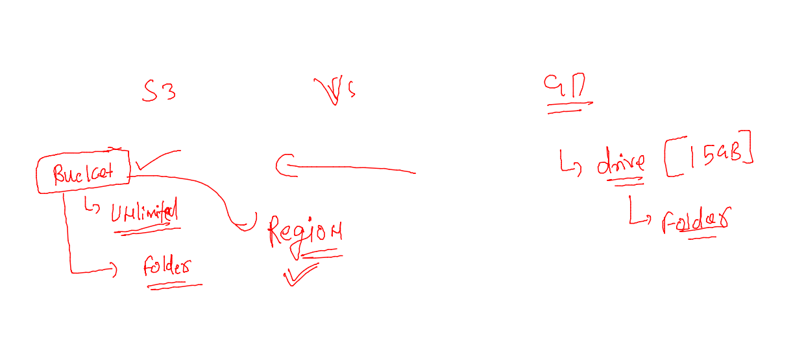

# devops-25ujne2022

### Linux target 

### aws cloud target 

## Object storage type 

### info about amazon s3 

### concept of bucket in s3

## s3 creating bucket 

### S3 details 

<ol>
  <li> S3 bucket and its object (data) are all private by default </li>
   <li> s3 bucket data want to access -- then we have to use aws account / public  </li>

</ol>

### to Enable bucket with public access 

### allow by policy 

