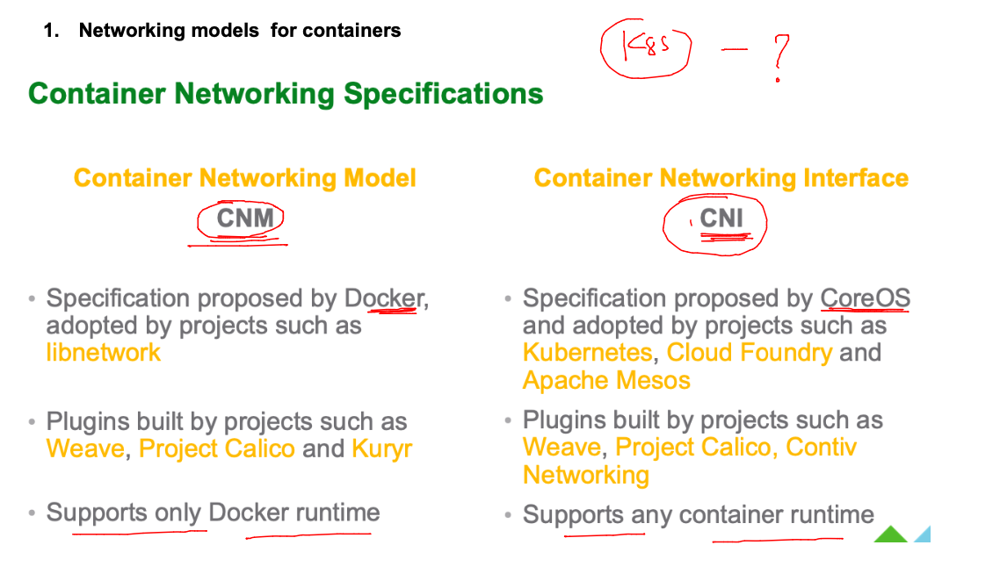
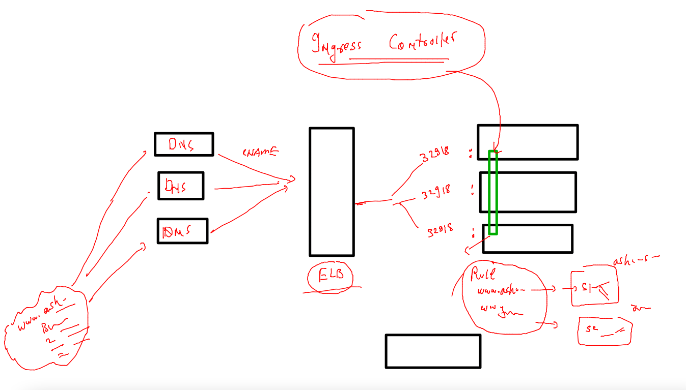

# devops-25ujne2022

### Linux target 


### aws cloud target 


### K8s Revision 


### Namespaces Understanding 


### Default namespaces in k8s 


### importance of kube-system namespace 

```
fire@ashutoshhs-MacBook-Air Desktop % kubectl   get  pod  -n kube-system 
NAME                                       READY   STATUS    RESTARTS      AGE
calico-kube-controllers-58dbc876ff-vjrt8   1/1     Running   7 (14m ago)   28d
calico-node-8sdk7                          1/1     Running   7 (14m ago)   28d
calico-node-d4zcc                          1/1     Running   7 (14m ago)   28d
calico-node-qzvk8                          1/1     Running   7 (13m ago)   28d
coredns-565d847f94-fh6bd                   1/1     Running   7 (14m ago)   28d
coredns-565d847f94-k6dzc                   1/1     Running   7 (14m ago)   28d
etcd-control-plane                         1/1     Running   7 (14m ago)   28d
kube-apiserver-control-plane               1/1     Running   7 (14m ago)   28d
kube-controller-manager-control-plane      1/1     Running   7 (14m ago)   28d
kube-proxy-4kqth                           1/1     Running   7 (14m ago)   28d
kube-proxy-9xrbh                           1/1     Running   7 (13m ago)   28d
kube-proxy-bkldn                           1/1     Running   7 (14m ago)   28d
kube-scheduler-control-plane               1/1     Running   7 (14m ago)   28d
metrics-server-767967fcd-r4ssv             1/1     Running   1 (13m ago)   4d
fire@ashutoshhs-MacBook-Air Desktop % 

```

### creating and set-default to a namespace 

```
fire@ashutoshhs-MacBook-Air Desktop % kubectl  create  namespace  ashu-space --dry-run=client -o yaml 
apiVersion: v1
kind: Namespace
metadata:
  creationTimestamp: null
  name: ashu-space
spec: {}
status: {}
fire@ashutoshhs-MacBook-Air Desktop % kubectl  create  namespace  ashu-space                          
namespace/ashu-space created
fire@ashutoshhs-MacBook-Air Desktop % kubectl  get  ns |   grep ashu
ashu-project           Active   4d7h
ashu-space             Active   6s
fire@ashutoshhs-MacBook-Air Desktop % kubectl  config set-context --current --namespace=ashu-space 
Context "kubernetes-admin@kubernetes" modified.
fire@ashutoshhs-MacBook-Air Desktop % 
fire@ashutoshhs-MacBook-Air Desktop % kubectl  get  pods
No resources found in ashu-space namespace.
fire@ashutoshhs-MacBook-Air Desktop % kubectl  get  svc 
No resources found in ashu-space namespace.
fire@ashutoshhs-MacBook-Air Desktop % kubectl  get  secret
No resources found in ashu-space namespace.
fire@ashutoshhs-MacBook-Air Desktop % 

```

### mention namespace entry in YAML 

```
apiVersion: v1
kind: Pod
metadata:
  creationTimestamp: null
  labels:
    run: ashupodx3
  name: ashupodx3
  namespace: kube-public # namespace field 
spec:
  containers:
  - image: nginx
    name: ashupodx3
    ports:
    - containerPort: 80
    resources: {}
  dnsPolicy: ClusterFirst
  restartPolicy: Always
status: {}

```

### apply if 

```
fire@ashutoshhs-MacBook-Air kubernetes % kubectl  get po,svc -n kube-public
No resources found in kube-public namespace.
fire@ashutoshhs-MacBook-Air kubernetes % kubectl apply -f auto.yaml -f np11.yaml 
pod/ashupodx3 created
service/ashulb1 created
fire@ashutoshhs-MacBook-Air kubernetes % 
fire@ashutoshhs-MacBook-Air kubernetes % 
fire@ashutoshhs-MacBook-Air kubernetes % kubectl  get po,svc -n kube-public     
NAME            READY   STATUS              RESTARTS   AGE
pod/ashupodx3   0/1     ContainerCreating   0          2s

NAME              TYPE       CLUSTER-IP      EXTERNAL-IP   PORT(S)          AGE
service/ashulb1   NodePort   10.108.67.129   <none>        1234:30332/TCP   2s
fire@ashutoshhs-MacBook-Air kubernetes % 

```

## Networking in k8s 


### choosing CNI over CNM by k8s 



### pods by default can communicate to each other even they are in different systems 


### lets verify that project calico is OUR CNI 

```
fire@ashutoshhs-MacBook-Air Desktop % kubectl  get po 
No resources found in ashu-space namespace.
fire@ashutoshhs-MacBook-Air Desktop % kubectl  run ashupod1 --image=alpine --command sleep 10000 
pod/ashupod1 created
fire@ashutoshhs-MacBook-Air Desktop % kubectl  get  po 
NAME       READY   STATUS              RESTARTS   AGE
ashupod1   0/1     ContainerCreating   0          3s
fire@ashutoshhs-MacBook-Air Desktop % kubectl  get  po 
NAME       READY   STATUS    RESTARTS   AGE
ashupod1   1/1     Running   0          6s
fire@ashutoshhs-MacBook-Air Desktop % kubectl  get  po -o wide
NAME       READY   STATUS    RESTARTS   AGE   IP                NODE      NOMINATED NODE   READINESS GATES
ashupod1   1/1     Running   0          10s   192.168.235.148   worker1   <none>           <none>
fire@ashutoshhs-MacBook-Air Desktop % kubectl  describe pod ashupod1 
Name:             ashupod1
Namespace:        ashu-space
Priority:         0
Service Account:  default
Node:             worker1/172.31.32.194
Start Time:       Wed, 16 Nov 2022 17:32:41 +0530
Labels:           run=ashupod1
Annotations:      cni.projectcalico.org/containerID: 6a1bb5970fb6751744c6c1e7e4113ba400ca975130bb1a4113dc4f7d090e98f2
                  cni.projectcalico.org/podIP: 192.168.235.148/32
                  cni.projectcalico.org/podIPs: 192.168.235.148/32
Status:           Running
IP:               192.168.235.148
IPs:
  IP:  192.168.235.148
Containers:

```

## OR 

```

fire@ashutoshhs-MacBook-Air Desktop % kubectl  get po -n kube-system                             
NAME                                       READY   STATUS    RESTARTS      AGE
calico-kube-controllers-58dbc876ff-vjrt8   1/1     Running   8 (32m ago)   29d
calico-node-8sdk7                          1/1     Running   8 (32m ago)   29d
calico-node-d4zcc                          1/1     Running   8 (32m ago)   29d
calico-node-qzvk8                          1/1     Running   8 (33m ago)   29d
```

# COntroller in k8s 

### k8s Nativ controllers 


### REplication controllers to scale pods  (horizentally)


### YAML of RC 

```
apiVersion: v1
kind: ReplicationController
metadata:
  name: ashu-rc-1 # name of rc 
spec: 
  replicas: 1 # number of pods we want 
  template:
    metadata:
      labels: # lable of pods 
        x: helloashu
    spec:
      containers:
      - name: ashuc1 
        image: nginx 
        ports:
        - containerPort: 80 
```

### lets do it 

```
fire@ashutoshhs-MacBook-Air kubernetes % kubectl apply -f rc1.yaml
replicationcontroller/ashu-rc-1 created
fire@ashutoshhs-MacBook-Air kubernetes % 
fire@ashutoshhs-MacBook-Air kubernetes % kubectl  get  rc 
NAME        DESIRED   CURRENT   READY   AGE
ashu-rc-1   1         1         1       6s
fire@ashutoshhs-MacBook-Air kubernetes % kubectl  get po 
NAME              READY   STATUS    RESTARTS   AGE
ashu-rc-1-5gm4z   1/1     Running   0          13s
fire@ashutoshhs-MacBook-Air kubernetes % kubectl delete pod ashu-rc-1-5gm4z
pod "ashu-rc-1-5gm4z" deleted
fire@ashutoshhs-MacBook-Air kubernetes % kubectl  get po                   
NAME              READY   STATUS    RESTARTS   AGE
ashu-rc-1-rkcst   1/1     Running   0          4s
fire@ashutoshhs-MacBook-Air kubernetes % 
```

### scaling pod without yaml change 

```
fire@ashutoshhs-MacBook-Air kubernetes % kubectl  get  rc             
NAME        DESIRED   CURRENT   READY   AGE
ashu-rc-1   1         1         1       2m30s
fire@ashutoshhs-MacBook-Air kubernetes % kubectl  scale rc  ashu-rc-1 --replicas=5
replicationcontroller/ashu-rc-1 scaled
fire@ashutoshhs-MacBook-Air kubernetes % kubectl  get  rc                         
NAME        DESIRED   CURRENT   READY   AGE
ashu-rc-1   5         5         5       2m46s
fire@ashutoshhs-MacBook-Air kubernetes % kubectl  get po                          
NAME              READY   STATUS    RESTARTS   AGE
ashu-rc-1-6jp6v   1/1     Running   0          9s
ashu-rc-1-d49hj   1/1     Running   0          9s
ashu-rc-1-rkcst   1/1     Running   0          2m26s
ashu-rc-1-rvb9z   1/1     Running   0          9s
```


### creating service using expose 

```
fire@ashutoshhs-MacBook-Air kubernetes % 
fire@ashutoshhs-MacBook-Air kubernetes % 
fire@ashutoshhs-MacBook-Air kubernetes % kubectl  get  rc
NAME        DESIRED   CURRENT   READY   AGE
ashu-rc-1   3         3         3       23h
fire@ashutoshhs-MacBook-Air kubernetes % kubectl  expose  rc  ashu-rc-1  --type NodePort --port 80 --name xyzsvc
service/xyzsvc exposed
fire@ashutoshhs-MacBook-Air kubernetes % kubectl  get  svc
NAME         TYPE       CLUSTER-IP       EXTERNAL-IP   PORT(S)          AGE
ashulb0099   NodePort   10.109.174.125   <none>        1234:31827/TCP   4m15s
xyzsvc       NodePort   10.104.173.221   <none>        80:30549/TCP     4s
fire@ashutoshhs-MacBook-Air kubernetes % kubectl  get  ep 
NAME         ENDPOINTS                                                 AGE
ashulb0099   192.168.189.77:80,192.168.235.171:80,192.168.235.188:80   4m30s
xyzsvc       192.168.189.77:80,192.168.235.171:80,192.168.235.188:80   19s
fire@ashutoshhs-MacBook-Air kubernetes % 


```

## How to deploy app in real world to be accessed by DNS name 


### How ingress is helping to avoid multiple LB 




## lets test ingress with Deployment controller 

### creating Deployment to deploy webapp 

```
kubectl create deployment  ashu-deploy1  --image=docker.io/dockerashu/ashuapp:appv1  --port 80  --dry-run=client -o yaml  >deploy1.yaml 
```
### lets deploy it 

```
fire@ashutoshhs-MacBook-Air kubernetes % kubectl apply -f deploy1.yaml 
deployment.apps/ashu-deploy1 created
fire@ashutoshhs-MacBook-Air kubernetes % 
fire@ashutoshhs-MacBook-Air kubernetes % kubectl  get deployment      
NAME           READY   UP-TO-DATE   AVAILABLE   AGE
ashu-deploy1   0/1     1            0           5s
fire@ashutoshhs-MacBook-Air kubernetes % kubectl  get deploy     
NAME           READY   UP-TO-DATE   AVAILABLE   AGE
ashu-deploy1   1/1     1            1           7s
fire@ashutoshhs-MacBook-Air kubernetes % kubectl  get rs    
NAME                      DESIRED   CURRENT   READY   AGE
ashu-deploy1-74c9f59b6c   1         1         1       12s
fire@ashutoshhs-MacBook-Air kubernetes % kubectl  get po
NAME                            READY   STATUS    RESTARTS   AGE
ashu-deploy1-74c9f59b6c-c9nrt   1/1     Running   0          15s
fire@ashutoshhs-MacBook-Air kubernetes % 
```

### scaling 

```
fire@ashutoshhs-MacBook-Air kubernetes % kubectl get deploy
NAME           READY   UP-TO-DATE   AVAILABLE   AGE
ashu-deploy1   1/1     1            1           39s
fire@ashutoshhs-MacBook-Air kubernetes % kubectl scale deployment ashu-deploy1 --replicas=3
deployment.apps/ashu-deploy1 scaled
fire@ashutoshhs-MacBook-Air kubernetes % kubectl get deploy                                
NAME           READY   UP-TO-DATE   AVAILABLE   AGE
ashu-deploy1   2/3     3            2           49s
fire@ashutoshhs-MacBook-Air kubernetes % kubectl  get po -o wide                           
NAME                            READY   STATUS              RESTARTS   AGE   IP                NODE      NOMINATED NODE   READINESS GATES
ashu-deploy1-74c9f59b6c-c9nrt   1/1     Running             0          53s   192.168.189.104   worker2   <none>           <none>
ashu-deploy1-74c9f59b6c-pl7cq   1/1     Running             0          5s    192.168.189.93    worker2   <none>           <none>
ashu-deploy1-74c9f59b6c-vhkzg   0/1     ContainerCreating   0          5s    <none>            worker1   <none>           <none>
fire@ashutoshhs-MacBook-Air kubernetes % 

```

### creating service of either LB / NP type 

```
fire@ashutoshhs-MacBook-Air kubernetes % kubectl  get  deploy 
NAME           READY   UP-TO-DATE   AVAILABLE   AGE
ashu-deploy1   3/3     3            3           110s
fire@ashutoshhs-MacBook-Air kubernetes % kubectl  expose deployment ashu-deploy1 --type LoadBalancer --port 80 --name ashulb1 
service/ashulb1 exposed
fire@ashutoshhs-MacBook-Air kubernetes % kubectl get svc
NAME      TYPE           CLUSTER-IP      EXTERNAL-IP   PORT(S)        AGE
ashulb1   LoadBalancer   10.103.87.178   <pending>     80:32206/TCP   4s
fire@ashutoshhs-MacBook-Air kubernetes % 
fire@ashutoshhs-MacBook-Air kubernetes % kubectl  expose deployment ashu-deploy1 --type NodePort --port 80 --name ashulb2 
service/ashulb2 exposed
fire@ashutoshhs-MacBook-Air kubernetes % kubectl get svc                                                                  
NAME      TYPE           CLUSTER-IP      EXTERNAL-IP   PORT(S)        AGE
ashulb1   LoadBalancer   10.103.87.178   <pending>     80:32206/TCP   21s
ashulb2   NodePort       10.101.178.32   <none>        80:30150/TCP   2s
fire@ashutoshhs-MacBook-Air kubernetes % 

```

### setup nginx ingress controller 

```
fire@ashutoshhs-MacBook-Air ~ % kubectl apply -f https://raw.githubusercontent.com/kubernetes/ingress-nginx/main/deploy/static/provider/baremetal/deploy.yaml
namespace/ingress-nginx created
serviceaccount/ingress-nginx created
serviceaccount/ingress-nginx-admission created
role.rbac.authorization.k8s.io/ingress-nginx created
role.rbac.authorization.k8s.io/ingress-nginx-admission created
clusterrole.rbac.authorization.k8s.io/ingress
```

## lets implement project with ingress in custom namepsace 

### creating ns 

```
 kubectl create ns ashu-project 
 kubectl config set-context --current --namespace=ashu-project
 
```

### deploy 

```
fire@ashutoshhs-MacBook-Air ingress-app % kubectl create deployment d1 --image=dockerashu/ashuapp:appv1 --port 80 --dry-run=clie
nt -o yaml  >deploy.yaml 
fire@ashutoshhs-MacBook-Air ingress-app % kubectl apply -f deploy.yaml 
deployment.apps/d1 created
fire@ashutoshhs-MacBook-Air ingress-app % kubectl get deploy 
NAME   READY   UP-TO-DATE   AVAILABLE   AGE
d1     1/1     1            1           6s
```

### creating service 

```
fire@ashutoshhs-MacBook-Air ingress-app % kubectl expose deploy d1 --type ClusterIP --port 80 --name ashulb1 --dry-run=client -o yaml >svc.yaml 
fire@ashutoshhs-MacBook-Air ingress-app % kubectl apply -f svc.yaml 
service/ashulb1 created
fire@ashutoshhs-MacBook-Air ingress-app % kubectl get  svc
NAME      TYPE        CLUSTER-IP    EXTERNAL-IP   PORT(S)   AGE
ashulb1   ClusterIP   10.96.102.2   <none>        80/TCP    4s
```

### creating ingress rule 

```
fire@ashutoshhs-MacBook-Air ingress-app % kubectl apply -f ingress.yaml 
ingress.networking.k8s.io/ashu-app-rule created
fire@ashutoshhs-MacBook-Air ingress-app % kubectl get ingress
NAME            CLASS   HOSTS                 ADDRESS   PORTS   AGE
ashu-app-rule   nginx   jaipur.ashutoshh.in             80      4s
fire@ashutoshhs-MacBook-Air ingress-app % 


```


