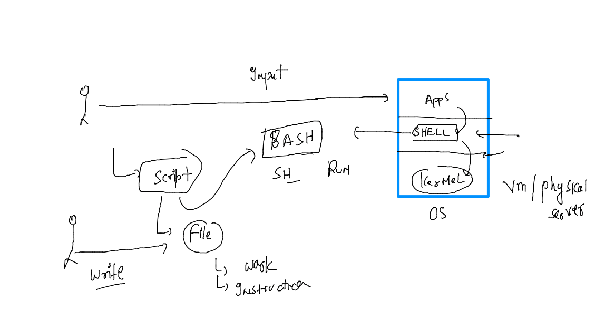

# task


### SHELL 



### number of shells supoprted by OS 

```
 cat  /etc/shells 
# /etc/shells: valid login shells
/bin/sh
/bin/bash
/usr/bin/bash
/bin/rbash
/usr/bin/rbash
/bin/dash
/usr/bin/dash
/usr/bin/tmux
/usr/bin/screen

```

### current shell 

```

mrinal@ip-172-31-89-79:~$ 
mrinal@ip-172-31-89-79:~$ 
mrinal@ip-172-31-89-79:~$ echo $SHELL
/bin/bash
mrinal@ip-172-31-89-79:~$ 

```

### features of bash shell

```
mrinal@ip-172-31-89-79:~$ history 
    1  whoami
    2  cat /etc/os-release 
    3  ls /home
    4  who
    5  date
    6  strace  date 
    7  date
    8  history 
    9  cat  /etc/os-release 
   10  cat  /etc/shells 
   11  echo $SHELL
   12  history 

```
### running command from history 

```
mrinal@ip-172-31-89-79:~$ !2
cat /etc/os-release 
NAME="Ubuntu"
VERSION="20.04.4 LTS (Focal Fossa)"
ID=ubuntu
ID_LIKE=debian
PRETTY_NAME="Ubuntu 20.04.4 LTS"
VERSION_ID="20.04"
HOME_URL="https://www.ubuntu.com/"

```
### echo usage

```
 echo  hello world 
hello world
mrinal@ip-172-31-89-79:~$ echo  100
100
mrinal@ip-172-31-89-79:~$ echo  100+100
100+100
mrinal@ip-172-31-89-79:~$ echo  "100+100"
100+100
mrinal@ip-172-31-89-79:~$ echo  '100+iii'
100+iii

```

### printing understanding 

```
 echo x
x
mrinal@ip-172-31-89-79:~$ x=100
mrinal@ip-172-31-89-79:~$ 
mrinal@ip-172-31-89-79:~$ echo x
x
mrinal@ip-172-31-89-79:~$ echo $x
100

```

### 

```
mrinal@ip-172-31-89-79:~$ echo SHELL
SHELL
mrinal@ip-172-31-89-79:~$ echo $SHELL
/bin/bash
mrinal@ip-172-31-89-79:~$ whoami
mrinal
mrinal@ip-172-31-89-79:~$ echo $USER
mrinal
mrinal@ip-172-31-89-79:~$ echo $LANG
C.UTF-8

```

### checking history size 

```
echo $HISTSIZE
1000
mrinal@ip-172-31-89-79:~$ 
```

### changing history size 


### task of today how to change size of history permanently 


