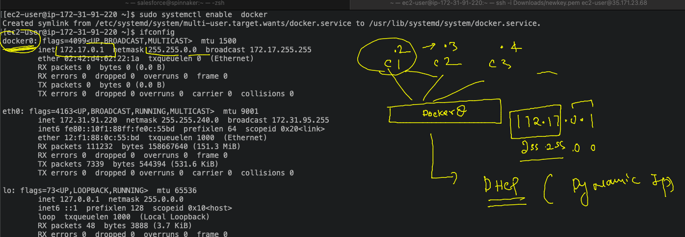

# devops-25ujne2022

### Linux target 


### aws cloud target 


## Understanding aws Vm networking and Container networking 


### docker create its own network bridge interface to assign ip address to each contaienr in DYnamic way 



### docker by default having 3 network bridge --

```
[root@ip-172-31-91-220 ~]# docker network  ls
NETWORK ID     NAME      DRIVER    SCOPE
54eddcf5b4b2   bridge    bridge    local
aa86b5c58452   host      host      local
72ee72b59700   none      null      local
[root@ip-172-31-91-220 ~]# docker network  inspect  54eddcf5b4b2 
[
    {
        "Name": "bridge",
        "Id": "54eddcf5b4b2a6b558119407717f178f242ccdf617fb07b0b19a8694c87ace9b",
        "Created": "2022-09-25T11:06:10.193326043Z",
        "Scope": "local",
        "Driver": "bridge",
        "EnableIPv6": false,
        "IPAM": {
            "Driver": "default",
            "Options": null,
            "Config": [
                {
                    "Subnet": "172.17.0.0/16"
                }
            ]
        },
        "Internal": false,
        "Attachable": false,
        "Ingress": false,
        "ConfigFrom": {
            "Network": ""
        },
        "ConfigOnly": false,
        "Containers": {},
        "Options": {
            "com.docker.network.bridge.default_bridge": "true",
            "com.docker.network.bridge.enable_icc": "true",
            "com.docker.network.bridge.enable_ip_masquerade": "true",
            "com.docker.network.bridge.host_binding_ipv4": "0.0.0.0",
            "com.docker.network.bridge.name": "docker0",
            "com.docker.network.driver.mtu": "1500"
        },
        "Labels": {}
    }
]

```

### by default each container will get ip from default bridge 

```
[root@ip-172-31-91-220 ~]# docker  ps
CONTAINER ID   IMAGE     COMMAND     CREATED              STATUS              PORTS     NAMES
332c8714863f   alpine    "/bin/sh"   About a minute ago   Up About a minute             c1
[root@ip-172-31-91-220 ~]# docker  exec -it  c1  sh 
/ # ifconfig 
eth0      Link encap:Ethernet  HWaddr 02:42:AC:11:00:02  
          inet addr:172.17.0.2  Bcast:172.17.255.255  Mask:255.255.0.0
          UP BROADCAST RUNNING MULTICAST  MTU:1500  Metric:1
          RX packets:13 errors:0 dropped:0 overruns:0 frame:0
          TX packets:0 errors:0 dropped:0 overruns:0 carrier:0
          collisions:0 txqueuelen:0 
          RX bytes:1150 (1.1 KiB)  TX bytes:0 (0.0 B)

lo        Link encap:Local Loopback  
          inet addr:127.0.0.1  Mask:255.0.0.0
          UP LOOPBACK RUNNING  MTU:65536  Metric:1
          RX packets:0 errors:0 dropped:0 overruns:0 frame:0
          TX packets:0 errors:0 dropped:0 overruns:0 carrier:0
          collisions:0 txqueuelen:1000 
          RX bytes:0 (0.0 B)  TX bytes:0 (0.0 B)

/ # exit
[root@ip-172-31-91-220 ~]# 

```

### contaienr --


### c-c networking is by default enabled 

```
[root@ip-172-31-91-220 ~]# docker  exec -it c2 sh
/ # ifconfig 
eth0      Link encap:Ethernet  HWaddr 02:42:AC:11:00:03  
          inet addr:172.17.0.3  Bcast:172.17.255.255  Mask:255.255.0.0
          UP BROADCAST RUNNING MULTICAST  MTU:1500  Metric:1
          RX packets:10 errors:0 dropped:0 overruns:0 frame:0
          TX packets:0 errors:0 dropped:0 overruns:0 carrier:0
          collisions:0 txqueuelen:0 
          RX bytes:780 (780.0 B)  TX bytes:0 (0.0 B)

lo        Link encap:Local Loopback  
          inet addr:127.0.0.1  Mask:255.0.0.0
          UP LOOPBACK RUNNING  MTU:65536  Metric:1
          RX packets:0 errors:0 dropped:0 overruns:0 frame:0
          TX packets:0 errors:0 dropped:0 overruns:0 carrier:0
          collisions:0 txqueuelen:1000 
          RX bytes:0 (0.0 B)  TX bytes:0 (0.0 B)

/ # ping  172.17.0.2
PING 172.17.0.2 (172.17.0.2): 56 data bytes
64 bytes from 172.17.0.2: seq=0 ttl=64 time=0.095 ms
64 bytes from 172.17.0.2: seq=1 ttl=64 time=0.088 ms
^C
--- 172.17.0.2 ping statistics ---
2 packets transmitted, 2 packets received, 0% packet loss
round-trip min/avg/max = 0.088/0.091/0.095 ms
```

### container can ping to host os IP also 

```
[root@ip-172-31-91-220 ~]# docker  exec -it c2 sh
/ # ping 172.31.91.220
PING 172.31.91.220 (172.31.91.220): 56 data bytes
64 bytes from 172.31.91.220: seq=0 ttl=255 time=0.064 ms
64 bytes from 172.31.91.220: seq=1 ttl=255 time=0.081 ms
^C
--- 172.31.91.220 ping statistics ---
2 packets transmitted, 2 packets received, 0% packet loss
round-trip min/avg/max = 0.064/0.072/0.081 ms
```

###  if main OS is having internet then container will also have 

```
[root@ip-172-31-91-220 ~]# docker  exec -it c2 sh
/ # ping 172.31.91.220
PING 172.31.91.220 (172.31.91.220): 56 data bytes
64 bytes from 172.31.91.220: seq=0 ttl=255 time=0.064 ms
64 bytes from 172.31.91.220: seq=1 ttl=255 time=0.081 ms
^C
--- 172.31.91.220 ping statistics ---
2 packets transmitted, 2 packets received, 0% packet loss
round-trip min/avg/max = 0.064/0.072/0.081 ms

 # ping www.google.com 
PING www.google.com (172.253.122.106): 56 data bytes
64 bytes from 172.253.122.106: seq=0 ttl=49 time=1.468 ms
64 bytes from 172.253.122.106: seq=1 ttl=49 time=1.605 ms
64 bytes from 172.253.122.106: seq=2 ttl=49 time=1.570 ms
^C

```

### NAT 


### outside people can access contaienr app using host port forwarding 


###

```
[root@ip-172-31-91-220 ~]# docker run -d --name c3 -p  1234:80  nginx  
Unable to find image 'nginx:latest' locally
latest: Pulling from library/nginx
31b3f1ad4ce1: Pull complete 
fd42b079d0f8: Pull complete 
30585fbbebc6: Pull complete 
18f4ffdd25f4: Pull complete 
9dc932c8fba2: Pull complete 
600c24b8ba39: Pull complete 
Digest: sha256:0b970013351304af46f322da1263516b188318682b2ab1091862497591189ff1
Status: Downloaded newer image for nginx:latest
e784cf1b9b4028c7551ae54d40a7af3f7ff754af0409319ac949c380b9d7750f
[root@ip-172-31-91-220 ~]# docker  ps
CONTAINER ID   IMAGE     COMMAND                  CREATED              STATUS              PORTS                                   NAMES
e784cf1b9b40   nginx     "/docker-entrypoint.…"   About a minute ago   Up About a minute   0.0.0.0:1234->80/tcp, :::1234->80/tcp   c3
69e2e0284308   alpine    "/bin/sh"                17 minutes ago       Up 17 minutes                                               c2

```


