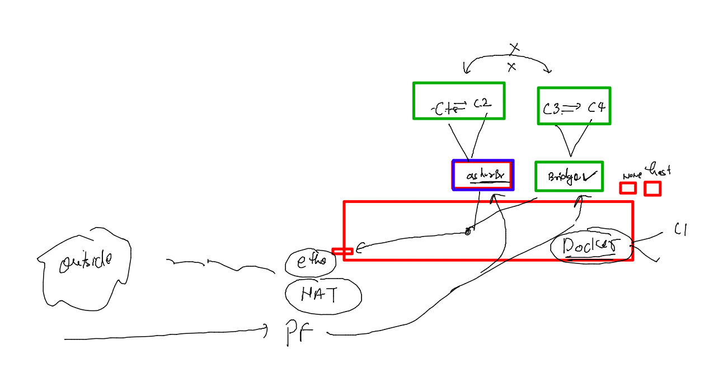

# devops-25ujne2022

### Linux target 


### aws cloud target 


### its not a good practise to use docker0 bridge by default 


### creating a new bridge 

```
[root@ip-172-31-91-4 ~]# docker  network  create  ashubr1 
34d588ae97acc08d542d9d81d15e3b217e0894107dd23b28b66c3796248a84b6
[root@ip-172-31-91-4 ~]# docker network ls
NETWORK ID     NAME      DRIVER    SCOPE
34d588ae97ac   ashubr1   bridge    local
ba8d2e98160e   bridge    bridge    local
82e9d6480631   host      host      local
9d2ab7b772c8   none      null      local
[root@ip-172-31-91-4 ~]# docker network inspect  ashubr1 
[
    {
        "Name": "ashubr1",
        "Id": "34d588ae97acc08d542d9d81d15e3b217e0894107dd23b28b66c3796248a84b6",
        "Created": "2022-09-26T11:52:38.638387217Z",
        "Scope": "local",
        "Driver": "bridge",
        "EnableIPv6": false,
        "IPAM": {
            "Driver": "default",
            "Options": {},
            "Config": [
                {
                    "Subnet": "172.18.0.0/16",
                    "Gateway": "172.18.0.1"

```

### custom bridge 



### creating container in custom bridge 

```
[root@ip-172-31-91-4 ~]# docker run -itd --name c3   --network  ashubr1  alpine 
43bc702195c958980bab21b2df585f3c24915a6a2b5062b751119246416a3b5d
[root@ip-172-31-91-4 ~]# 
[root@ip-172-31-91-4 ~]# docker run -itd --name c4   --net  ashubr1  alpine 
dffc76c9ae14eb4e5ede00a98275130f3abbc74aa6a96b7c35a003052a919432
[root@ip-172-31-91-4 ~]# docker network inspect  ashubr1
[
    {
        "Name": "ashubr1",
        "Id": "34d588ae97acc08d542d9d81d15e3b217e0894107dd23b28b66c3796248a84b6",
        "Created": "2022-09-26T11:52:38.638387217Z",
        "Scope": "local",
        "Driver": "bridge",
        "EnableIPv6": false,
        "IPAM": {
            "Driver": "default",
            "Options": {},
            "Config": [
                {
                    "Subnet": "172.18.0.0/16",
                    "Gateway": "172.18.0.1"
                }
            ]
        },
        "Internal": false,
        "Attachable": false,
        "Ingress": false,
        "ConfigFrom": {
            "Network": ""
        },
        "ConfigOnly": false,
        "Containers": {
            "43bc702195c958980bab21b2df585f3c24915a6a2b5062b751119246416a3b5d": {
                "Name": "c3",
                "EndpointID": "42222dba8dc4e1f7efecaea4af429db9b9deb7117b0a06ece557f1053796d04f",
                "MacAddress": "02:42:ac:12:00:02",
                "IPv4Address": "172.18.0.2/16",
                "IPv6Address": ""
            },
            "dffc76c9ae14eb4e5ede00a98275130f3abbc74aa6a96b7c35a003052a919432": {
                "Name": "c4",
                "EndpointID": "8b6bbd55dc036b02166c438143eed488e57ea685bd06428cbf55b8340ac971bd",
                "MacAddress": "02:42:ac:12:00:03",
                "IPv4Address": "172.18.0.3/16",

```

### custom bridge 

```
[root@ip-172-31-91-4 ~]# docker  exec -it c3 sh 
/ # 
/ # 
/ # ping  c4 
PING c4 (172.18.0.3): 56 data bytes
64 bytes from 172.18.0.3: seq=0 ttl=64 time=0.109 ms
64 bytes from 172.18.0.3: seq=1 ttl=64 time=0.094 ms
64 bytes from 172.18.0.3: seq=2 ttl=64 time=0.082 ms
^C
--- c4 ping statistics ---
3 packets transmitted, 3 packets received, 0% packet loss
round-trip min/avg/max = 0.082/0.095/0.109 ms
/ # exit

```

### custom bridge with custom subnet 

```
[root@ip-172-31-91-4 ~]# docker  network  create  ashubr2  --subnet  192.168.100.0/24  --gateway 192.168.100.1 
6aef96bb7be6ca39b86b27641855fdb7e07c7842d53ecf4a3e9f9d1641195cd0
[root@ip-172-31-91-4 ~]# docker network ls
NETWORK ID     NAME      DRIVER    SCOPE
34d588ae97ac   ashubr1   bridge    local
6aef96bb7be6   ashubr2   bridge    local
ba8d2e98160e   bridge    bridge    local
82e9d6480631   host      host      local
9d2ab7b772c8   none      null      local
[root@ip-172-31-91-4 ~]# docker  run -itd --name c5 --net  ashubr2  alpine 
2c7687f1ec5c92b3e1f44157d38fa6989a8d8bcf97a8803c0b4b54b8dd8878df
[root@ip-172-31-91-4 ~]# 
[root@ip-172-31-91-4 ~]# docker  run -itd --name c6 --net  ashubr2 --ip  192.168.100.200  alpine 
4feafda4f5809bb10699f36eae555f26b226567d9cad15e78c7ecbd8e61de1e2
[root@ip-172-31-91-4 ~]# 
[root@ip-172-31-91-4 ~]# docker  exec c6 ifconfig 
eth0      Link encap:Ethernet  HWaddr 02:42:C0:A8:64:C8  
          inet addr:192.168.100.200  Bcast:192.168.100.255  Mask:255.255.255.0
          UP BROADCAST RUNNING MULTICAST  MTU:1500  Metric:1
          RX packets:7 errors:0 dropped:0 overruns:0 frame:0
          TX packets:0 errors:0 dropped:0 overruns:0 carrier:0
          collisions:0 txqueuelen:0 
          RX bytes:570 (570.0 B)  TX bytes:0 (0.0 B)

lo        Link encap:Local Loopback  
          inet addr:127.0.0.1  Mask:255.0.0.0
          UP LOOPBACK RUNNING  MTU:65536  Metric:1
          RX packets:0 errors:0 dropped:0 overruns:0 frame:0
          TX packets:0 errors:0 dropped:0 overruns:0 carrier:0
          collisions:0 txqueuelen:1000 
          RX bytes:0 (0.0 B)  TX bytes:0 (0.0 B)


```


